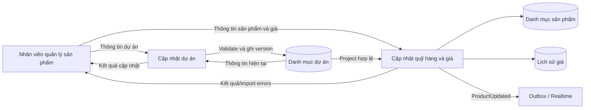
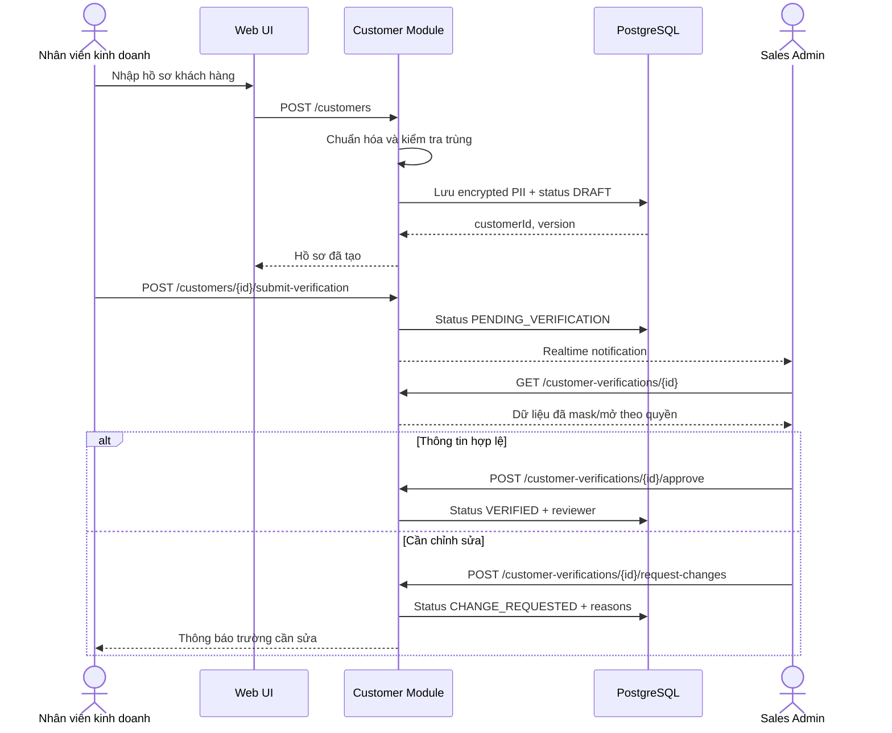
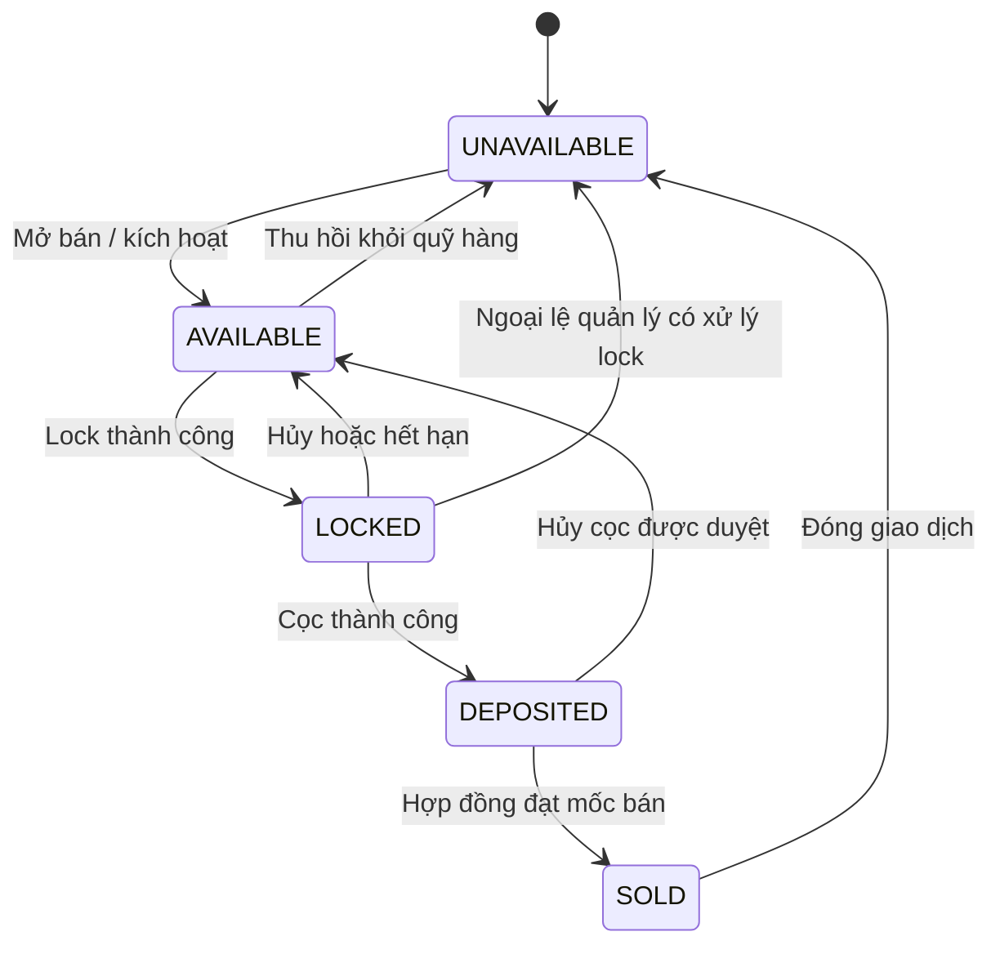
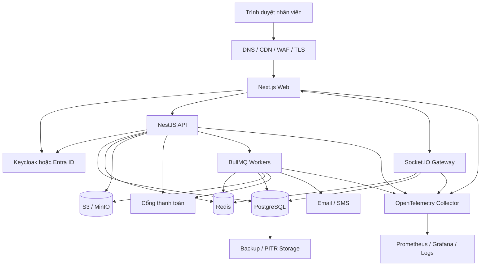
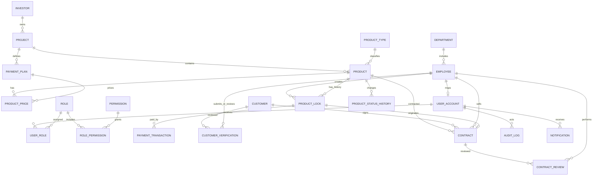

# Kế hoạch thiết kế và triển khai website quản lý sản phẩm, khách hàng và giao dịch bất động sản AHS

## Tóm tắt điều hành

Tài liệu đặc tả mô tả một hệ thống nội bộ phục vụ quản lý quỹ hàng bất động sản và quy trình bán hàng tại Công ty Cổ phần Bất động sản AHS. Hệ thống có ba nhóm người dùng nghiệp vụ chính: nhân viên quản lý sản phẩm, nhân viên kinh doanh và Sales Admin. Các nghiệp vụ trọng tâm gồm quản lý chủ đầu tư, dự án, loại sản phẩm và sản phẩm; khóa căn trong 30 phút; tạo mã QR thanh toán cọc; tiếp nhận và xác minh khách hàng; kiểm duyệt hợp đồng; cập nhật trạng thái quỹ hàng theo thời gian thực; và lập báo cáo doanh thu, lượng hàng bán, doanh số nhân viên dưới dạng màn hình hoặc PDF. Các nội dung này được thể hiện xuyên suốt phần yêu cầu chức năng, BFD, sơ đồ ngữ cảnh, DFD mức 0 và mức 1, biểu đồ lớp, các activity diagram và mẫu giao diện từ trang 1 đến trang 21 của đặc tả. fileciteturn0file0

Kiến trúc được khuyến nghị là **modular monolith hướng sự kiện**, thay vì microservice ngay từ đầu. Một ứng dụng backend vẫn được chia thành các module miền độc lập như Inventory, Customer, Lock, Payment, Contract, Report và Audit; các công việc nền chạy trong worker riêng; giao tiếp thời gian thực chạy qua Socket.IO; PostgreSQL là nguồn dữ liệu chuẩn; Redis chỉ đảm nhiệm cache, rate limit, Socket.IO adapter và hàng đợi BullMQ. Cách tổ chức này cho phép duy trì giao dịch nhất quán cho nghiệp vụ tranh chấp khóa căn, trong khi vẫn có đường nâng cấp lên microservice nếu khối lượng giao dịch hoặc quy mô đội phát triển tăng mạnh.

Ngăn xếp công nghệ cơ sở được đề xuất là **TypeScript end-to-end**, gồm Next.js App Router cho frontend, NestJS cho backend, PostgreSQL, Prisma ORM, Redis, BullMQ, Socket.IO, Keycloak/OpenID Connect, S3-compatible object storage, Docker, GitHub Actions và OpenTelemetry–Prometheus–Grafana. Next.js App Router hỗ trợ layouts, Server Components, streaming và cấu trúc định tuyến theo file; NestJS có module chính thức cho WebSocket, OpenAPI, queue và rate limiting; PostgreSQL cung cấp transaction và row-level locking cần thiết cho thao tác giành quyền khóa căn. citeturn0search0turn1search0turn1search1turn8search0turn0search20

Điểm quan trọng nhất của thiết kế là không dùng một transaction cơ sở dữ liệu kéo dài 30 phút. Khi nhân viên nhấn “lock căn”, backend chỉ giữ row lock trong vài mili giây để kiểm tra và ghi nhận quyền giữ căn, sau đó commit. Thời hạn 30 phút được lưu thành `expires_at`; một delayed job và một tiến trình đối soát định kỳ sẽ giải phóng lock hết hạn. Cơ sở dữ liệu áp dụng unique partial index để bảo đảm một sản phẩm không thể có hai lock hoạt động đồng thời. Redis có thể tăng tốc nhưng không được coi là nguồn xác thực cuối cùng. PostgreSQL khuyến cáo không giữ transaction mở trong khi chờ tương tác người dùng; row-level lock chỉ nên tồn tại đến cuối transaction ngắn. citeturn0search14turn0search19turn8search7

| Hạng mục | Quyết định cơ sở |
|---|---|
| Loại hệ thống | Ứng dụng web nội bộ, responsive, ưu tiên desktop |
| Kiến trúc | Modular monolith + worker + realtime gateway |
| Frontend | Next.js App Router, React, TypeScript, Ant Design, TanStack Query, React Hook Form, Zod |
| Backend | NestJS, Fastify adapter, TypeScript, REST/OpenAPI |
| Cơ sở dữ liệu | PostgreSQL |
| ORM và migration | Prisma ORM, Prisma Migrate, bổ sung migration SQL tùy chỉnh |
| Cache và rate limit | Redis |
| Hàng đợi | BullMQ trên Redis |
| Realtime | Socket.IO qua NestJS Gateway; Redis adapter khi chạy nhiều instance |
| Xác thực | OpenID Connect qua Keycloak; Microsoft Entra ID là phương án thay thế |
| Lưu tệp | S3-compatible object storage; MinIO cho on-premise |
| Xuất PDF | HTML template + Playwright/Chromium trong worker |
| Quan sát hệ thống | OpenTelemetry, Prometheus, Grafana, Loki hoặc backend log tương đương |
| Đóng gói | Docker |
| CI/CD | GitHub Actions |
| Mô hình triển khai mặc định | Managed containers hoặc Kubernetes tùy quy mô |
| Thời gian MVP production-ready | Khoảng 16 tuần với đội 6–8 người |

## Phân tích đặc tả, phạm vi và các giả định

Đặc tả hiện tại có giá trị tốt ở cấp độ phân tích nghiệp vụ: BFD chia hệ thống thành bốn nhóm chức năng; DFD chỉ ra tác nhân, kho dữ liệu và trao đổi dữ liệu; biểu đồ lớp xác định các thực thể cốt lõi; activity diagram mô tả các bước nghiệp vụ; các mockup thể hiện cách nhân viên tương tác với bảng hàng và biểu mẫu. Tuy nhiên, tài liệu chưa đủ để triển khai trực tiếp vì còn thiếu mô hình xác thực, thanh toán, phân quyền chi tiết, xử lý đồng thời, nhật ký kiểm toán, phiên bản dữ liệu, cấu trúc giá theo phương án, tệp hợp đồng, webhook, quy tắc lỗi và các yêu cầu vận hành. fileciteturn0file0

**Phạm vi nghiệp vụ được xác nhận từ đặc tả**

| Miền | Phạm vi được mô tả |
|---|---|
| Quản lý sản phẩm | Cập nhật chủ đầu tư, dự án, loại sản phẩm, mã căn, diện tích, hướng, giá, phương án thanh toán, phương án bàn giao và trạng thái |
| Quản lý quỹ hàng | Hiển thị bảng hàng; cập nhật trạng thái còn hàng, đang lock, đã cọc, đã bán hoặc không có hàng |
| Quản lý lock | Nhân viên kinh doanh khóa căn trong 30 phút; căn không được nhân viên khác khóa trong thời gian này |
| Thanh toán cọc | Hệ thống sinh thông tin/mã QR; nhận kết quả từ cổng thanh toán; xác nhận cọc thành công hoặc hết hạn |
| Khách hàng | Lưu họ tên, số điện thoại, CCCD, email, địa chỉ; xác minh trước khi hoàn tất giao dịch |
| Hợp đồng | Tạo thông tin hợp đồng; Sales Admin đối chiếu sản phẩm–khách hàng–giao dịch; phê duyệt, từ chối hoặc yêu cầu chỉnh sửa |
| Báo cáo | Doanh thu, số giao dịch, lượng hàng theo dự án, doanh số nhân viên; xuất PDF |
| Phi chức năng | Giao diện thân thiện, tiếng Việt, hiệu suất, đồng bộ, bảo mật, mở rộng, tích hợp, backup và phục hồi |

Nguồn đặc tả nêu rằng nhân viên quản lý sản phẩm cập nhật dự án và quỹ hàng; nhân viên kinh doanh theo dõi bảng hàng, khóa căn, chờ khách chuyển cọc trong 30 phút rồi khai báo khách hàng; Sales Admin kiểm duyệt quan hệ giữa khách hàng, sản phẩm và giao dịch. Các activity diagram trên trang 13–16 củng cố ba luồng này, còn các mockup trên trang 17–19 thể hiện màn hình tạo sản phẩm, bảng hàng, nhập khách hàng và duyệt hợp đồng. fileciteturn0file0

**Mô hình vai trò đề xuất**

| Vai trò | Nguồn | Quyền chính | Giới hạn quan trọng |
|---|---|---|---|
| Nhân viên quản lý sản phẩm | Có trong đặc tả | Quản lý chủ đầu tư, dự án, loại sản phẩm, sản phẩm, giá và trạng thái nguồn hàng | Không xác nhận thanh toán hoặc duyệt hợp đồng |
| Nhân viên kinh doanh | Có trong đặc tả | Xem quỹ hàng, tạo/cancel lock của mình, tạo yêu cầu thanh toán, nhập khách hàng, lập hồ sơ hợp đồng | Không sửa trực tiếp trạng thái bán; không xem toàn bộ CCCD ngoài hồ sơ được phân công |
| Sales Admin | Có trong đặc tả | Xác minh khách hàng, đối chiếu thanh toán, duyệt hoặc yêu cầu sửa hợp đồng | Không sửa giá gốc của sản phẩm |
| Quản lý kinh doanh | Đề xuất bổ sung | Xem toàn bộ báo cáo, phê duyệt ngoại lệ, chuyển người phụ trách | Không quản trị hạ tầng |
| Kế toán/đối soát | Đề xuất bổ sung | Xem giao dịch thanh toán, đối soát, xử lý chênh lệch, xác nhận thủ công có kiểm soát | Không quản lý quỹ hàng |
| Quản trị hệ thống | Đề xuất bổ sung | Quản lý tài khoản, role, cấu hình, tích hợp, audit log | Không được tự duyệt giao dịch kinh doanh nếu áp dụng phân tách nhiệm vụ |
| Kiểm toán viên | Đề xuất bổ sung | Chỉ đọc audit log, lịch sử giá, lịch sử trạng thái, báo cáo | Không có quyền sửa |
| Khách hàng | Tác nhân ngoài hệ thống | Cung cấp thông tin, nhận QR, nhận tài liệu/hợp đồng | Không cần tài khoản trong MVP |
| Chủ đầu tư | Tác nhân ngoài hệ thống | Cung cấp dự án/quỹ hàng; nhận thông tin khách hàng/giao dịch theo thỏa thuận | Tích hợp portal/API để ở giai đoạn sau |
| Cổng thanh toán/ngân hàng | Tác nhân ngoài hệ thống | Nhận yêu cầu QR; phát webhook trạng thái thanh toán | Chỉ được gọi endpoint webhook đã ký |

**Các mâu thuẫn và khoảng trống cần xử lý trước khi lập trình**

| Vấn đề trong đặc tả | Tác động | Quyết định đề xuất |
|---|---|---|
| `MaCan` là `int` ở bảng Sản phẩm nhưng là `nvarchar(20)` ở Lượt lock và Hợp đồng | Không thể tạo foreign key nhất quán | Dùng UUID làm khóa kỹ thuật `product_id`; thêm `product_code varchar(50)` làm mã căn nghiệp vụ |
| Tên dự án và tên chủ đầu tư có độ dài `nvarchar(10)` | Không đủ cho tên thực tế | Dùng `varchar(255)` hoặc `text`; chuẩn hóa tìm kiếm |
| Yêu cầu khách hàng có địa chỉ nhưng bảng Khách hàng không có trường địa chỉ | Mất dữ liệu cần cho hợp đồng | Bổ sung `address`, có thể tách tỉnh/quận/phường nếu cần |
| Yêu cầu giá theo nhiều phương án nhưng bảng Sản phẩm chỉ có một `GiaNiemYet` | Không biểu diễn được lịch thanh toán và giá theo phương án | Tạo `payment_plans` và `product_prices` có hiệu lực theo thời gian |
| DFD có cổng thanh toán nhưng class diagram không có Payment | Không thể lưu QR, webhook, đối soát hoặc hoàn tiền | Bổ sung `payment_transactions` và `payment_webhook_events` |
| Không có bảng tài khoản, role, permission | Không đáp ứng yêu cầu xác thực và phân quyền | Dùng IdP OIDC; lưu `user_accounts`, `roles`, `permissions`, `user_roles` hoặc đồng bộ claims |
| Trạng thái sản phẩm không nhất quán: “trống”, “còn hàng”, “đã cọc”, “đã bán”, “không có hàng” | Dễ tạo chuyển trạng thái sai | Chuẩn hóa state machine duy nhất |
| Lock chỉ có thời gian bắt đầu/kết thúc; không có idempotency hoặc phiên bản | Dễ tạo lock trùng khi double-click/retry | Bổ sung `idempotency_key`, `version`, partial unique index và transaction |
| Hợp đồng không có trạng thái kiểm duyệt, người duyệt, lý do từ chối | Không triển khai được activity diagram Sales Admin | Bổ sung state, review history, reviewer, rejection/change reason |
| Không có bảng lịch sử trạng thái | Không thể kiểm toán ai đổi gì | Bổ sung event/history và audit log bất biến |
| Không có tệp đính kèm | Không lưu được bản hợp đồng, chứng từ cọc, biên bản | Bổ sung object storage và `file_attachments` |
| Không có mô hình soft delete | Xóa dữ liệu có thể phá vỡ báo cáo và audit | Dùng `archived_at`/`deleted_at`; không hard-delete giao dịch |
| Báo cáo được mô tả nhưng chưa định nghĩa doanh thu ghi nhận khi nào | KPI có thể sai | Chốt rule: theo cọc thành công, hợp đồng ký, hay thanh toán đủ |
| QR và cổng thanh toán chưa xác định nhà cung cấp | Không biết schema webhook, signature hoặc SLA | Dùng Payment Provider Adapter; chọn nhà cung cấp ở discovery |
| “Khách chuyển cọc trong 30 phút” chưa nêu xử lý tiền đến muộn | Tranh chấp căn | Định nghĩa luồng late payment và hàng chờ đối soát thủ công |

**Giả định cơ sở để hoàn chỉnh kế hoạch**

| Chủ đề mở | Giả định dùng cho thiết kế | Cần xác nhận |
|---|---|---|
| Đối tượng sử dụng | Website nội bộ cho nhân viên AHS; khách hàng không đăng nhập trong MVP | Có cần customer portal hay không |
| Ngôn ngữ | Giao diện tiếng Việt; kiến trúc sẵn sàng cho i18n | Có cần tiếng Anh ngay ở phiên bản đầu |
| Quy mô dữ liệu | 10.000–200.000 sản phẩm; tối đa vài triệu bản ghi lịch sử | Số dự án, số căn và thời gian lưu dữ liệu thực tế |
| Đồng thời | 50–300 người dùng đồng thời; đỉnh lock có thể tập trung khi mở bán | Số nhân viên cùng thao tác trong một đợt mở bán |
| Thời gian lock | Mặc định 30 phút, cấu hình theo dự án | Có cần gia hạn hoặc hàng chờ hay không |
| Giá trị tiền | VND, lưu bằng `numeric(19,0)` hoặc số nguyên đồng | Có giao dịch ngoại tệ hay thuế/phí riêng |
| Trạng thái “đã bán” | Chỉ chuyển sau khi hợp đồng được ký hoặc đạt mốc do quản lý cấu hình | Mốc nghiệp vụ chính xác |
| Xác minh CCCD | Sales Admin kiểm tra thủ công trong MVP | Có tích hợp eKYC hay OCR hay không |
| Thanh toán | QR chuyển khoản động hoặc nội dung chuyển khoản duy nhất; webhook từ provider | Nhà cung cấp, ngân hàng và chuẩn QR |
| Hosting | Cloud hoặc data center tại Việt Nam; môi trường dev/staging/prod tách biệt | Yêu cầu lưu trú dữ liệu, nhà cung cấp cloud |
| Khả dụng | Mục tiêu ban đầu 99,9% theo tháng | SLA hợp đồng thực tế |
| Khôi phục | RPO 15 phút, RTO 2 giờ cho production | Mức độ chịu mất dữ liệu và thời gian ngừng chấp nhận được |
| Đội dự án | 1 PM/BA, 1 UX, 2 frontend, 2 backend, 1 QA, DevOps bán thời gian | Nhân lực hiện có |

**Tiêu chí nghiệm thu cấp hệ thống**

| Chỉ số | Mục tiêu ban đầu |
|---|---|
| Độ trễ đọc bảng hàng | P95 dưới 500 ms khi dữ liệu đã cache; dưới 1 giây khi truy vấn DB |
| Độ trễ tạo lock | P95 dưới 800 ms, không tính độ trễ mạng người dùng |
| Xung đột lock | Không có hai active lock cho cùng một sản phẩm |
| Realtime | Người dùng trong cùng dự án nhận thay đổi trạng thái trong vòng 1–2 giây |
| Payment webhook | Xử lý idempotent; không ghi nhận cọc hai lần |
| Tính toàn vẹn | Tất cả chuyển trạng thái phải tuân theo state machine và có audit |
| Bảo mật | MFA cho role nhạy cảm; mã hóa TLS; CCCD được bảo vệ ở mức trường hoặc token hóa |
| Báo cáo | Số liệu đối chiếu được với giao dịch nguồn; PDF có thời gian và người tạo |
| Backup | Khôi phục thử nghiệm thành công theo lịch ít nhất hàng quý |
| Accessibility | Điều hướng bàn phím, label form, trạng thái không chỉ biểu diễn bằng màu |
| Chất lượng | Không phát hành khi concurrency test, E2E giao dịch hoặc migration test thất bại |

## Thiết kế chức năng và ánh xạ toàn bộ luồng dữ liệu

**Danh mục chức năng chi tiết**

| Mã miền | Chức năng | Hành vi và quy tắc |
|---|---|---|
| IAM | Đăng nhập và phiên làm việc | Chuyển hướng tới IdP; sử dụng Authorization Code Flow với PKCE; backend xác minh JWT; phiên hết hạn buộc refresh hoặc đăng nhập lại; MFA bắt buộc với Sales Admin, quản lý và admin |
| IAM | Phân quyền | RBAC ở cấp chức năng kết hợp ABAC ở cấp dữ liệu; ví dụ nhân viên chỉ xem hồ sơ khách hàng do mình phụ trách, Sales Admin xem hồ sơ trong phạm vi dự án/phòng ban |
| Organization | Phòng ban và nhân viên | Đồng bộ nhân viên với tài khoản; quản lý trạng thái active/inactive; không xóa nhân viên đã có giao dịch |
| Investor | Chủ đầu tư | CRUD có kiểm soát; chống trùng theo mã và tên chuẩn hóa; lưu thông tin liên hệ và trạng thái |
| Project | Dự án | Tạo dự án, chủ đầu tư, vị trí, trạng thái triển khai, thời gian mở bán, cấu hình thời gian lock và chính sách giá |
| Product Type | Loại sản phẩm | Căn hộ, shophouse, biệt thự hoặc loại khác; có metadata mở rộng |
| Inventory | Sản phẩm | Tạo, sửa, import hàng loạt; lưu mã căn, tòa, tầng, diện tích, hướng, loại, dự án, phương án bàn giao, thuộc tính mở rộng |
| Pricing | Giá và phương án thanh toán | Giá niêm yết, giá theo phương án, lịch thanh toán, thời gian hiệu lực; không ghi đè lịch sử giá |
| Inventory | Bảng hàng | Lọc theo dự án, loại, tòa, tầng, diện tích, giá và trạng thái; cập nhật realtime; dùng màu kèm text/icon |
| Inventory | Chuyển trạng thái | Chỉ service miền được quyền chuyển trạng thái; người dùng không gửi trực tiếp trạng thái tùy ý |
| Lock | Tạo lock | Kiểm tra quyền, dự án đang bán, sản phẩm AVAILABLE, không có active lock; ghi lock và đổi sản phẩm sang LOCKED trong một transaction |
| Lock | Đếm ngược | Client hiển thị `expiresAt` dựa trên thời gian server; không tự quyết định hết hạn |
| Lock | Gia hạn | Tắt mặc định; nếu bật phải có permission, số lần giới hạn và audit |
| Lock | Hủy/giải phóng | Chủ lock hoặc quản lý được phép hủy; job tự động giải phóng khi hết hạn |
| Payment | Tạo QR | Backend tạo payment intent gắn với lock; provider adapter sinh QR hoặc payload; số tiền và nội dung chuyển khoản do server quyết định |
| Payment | Tiếp nhận webhook | Xác minh chữ ký, timestamp và provider event ID; ghi raw event; xử lý idempotent |
| Payment | Đối soát | So sánh số tiền, nội dung, tài khoản, thời gian; chênh lệch chuyển trạng thái REVIEW_REQUIRED |
| Customer | Tạo khách hàng | Chỉ sau lock hoặc cọc theo policy; kiểm tra định dạng CCCD, số điện thoại, email; dò trùng |
| Customer | Xác minh | Sales Admin duyệt hoặc yêu cầu sửa; lưu reviewer và lịch sử |
| Contract | Tạo hồ sơ | Snapshot giá, sản phẩm, khách hàng và thanh toán; không phụ thuộc hoàn toàn vào dữ liệu có thể thay đổi sau này |
| Contract | Trình duyệt | Kiểm tra đủ trường, cọc thành công, khách hàng hợp lệ; chuyển PENDING_REVIEW |
| Contract | Yêu cầu sửa | Sales Admin ghi rõ field hoặc lý do; sales sửa rồi trình lại |
| Contract | Phê duyệt/từ chối | Phê duyệt có optimistic concurrency; từ chối yêu cầu lý do; mọi hành động có audit |
| Contract | Ký và hoàn tất | Lưu số hợp đồng, thời gian ký, file; chuyển sản phẩm theo rule nghiệp vụ |
| Report | Dashboard | KPI doanh thu, số giao dịch, active lock, tỷ lệ chuyển đổi, hàng theo trạng thái |
| Report | Báo cáo doanh thu | Theo ngày/tháng/quý/dự án/nhân viên; xác định rõ cơ sở ghi nhận |
| Report | Báo cáo hàng dự án | Tổng sản phẩm, còn hàng, lock, đã cọc, đã bán |
| Report | Doanh số nhân viên | Số lock, số cọc, số hợp đồng, doanh thu và conversion |
| Report | Xuất PDF | Chạy bất đồng bộ; lưu file vào object storage; thông báo khi hoàn tất |
| Audit | Nhật ký | Ghi actor, action, entity, trước/sau, IP, user agent, request ID, timestamp |
| Notification | Thông báo | In-app realtime; tùy chọn email/SMS cho sự kiện quan trọng |
| Integration | Import/export | CSV/XLSX được kiểm tra trước; import theo batch; có báo cáo dòng lỗi |
| Administration | Cấu hình | Thời hạn lock, mức cọc, provider, template hợp đồng, retention, rate limit theo môi trường |

### Ánh xạ sơ đồ ngữ cảnh

Sơ đồ ngữ cảnh ở trang 5 chỉ ra ba tác nhân ngoài: Khách hàng, Chủ đầu tư và Cổng thanh toán. Hệ thống nhận thông tin khách hàng, nhận thông tin sản phẩm từ chủ đầu tư, gửi thông tin giao dịch tới cổng thanh toán, nhận thông tin thanh toán, gửi hợp đồng cho khách và gửi dữ liệu khách hàng/giao dịch cho chủ đầu tư. Trong triển khai, nhân viên AHS là người thao tác thay khách hàng và chủ đầu tư ở MVP; tích hợp trực tiếp qua portal/API có thể được bổ sung sau. fileciteturn0file0

| Luồng ngữ cảnh | Dữ liệu | Điểm vào/ra triển khai | Kiểm soát |
|---|---|---|---|
| Khách hàng → hệ thống | Họ tên, CCCD, điện thoại, email, địa chỉ, lựa chọn thanh toán | Form do nhân viên nhập hoặc customer portal tương lai | Consent notice, validation, encryption, duplicate detection |
| Hệ thống → khách hàng | QR, biên nhận cọc, thông tin hợp đồng | Màn hình, email/SMS hoặc link bảo mật | Link có TTL, không lộ CCCD, audit gửi |
| Chủ đầu tư → hệ thống | Dự án, sản phẩm, giá, trạng thái nguồn hàng | Import CSV/XLSX, API hoặc thao tác nhân viên | Schema validation, staging import, approval |
| Hệ thống → chủ đầu tư | Khách hàng và giao dịch được phép chia sẻ | Export/API adapter | Data minimization, masking, legal basis |
| Hệ thống → cổng thanh toán | Payment intent, số tiền, mã tham chiếu, callback metadata | Provider API | TLS, credential vault, timeout/retry |
| Cổng thanh toán → hệ thống | Event thanh toán, mã giao dịch, số tiền, trạng thái | Webhook | Signature, replay protection, idempotency, allowlist nếu khả thi |

### Ánh xạ DFD mức không

DFD mức 0 ở trang 6 có bốn tiến trình: quản lý sản phẩm, quản lý thông tin khách hàng, quản lý giao dịch và báo cáo; ba tác nhân nội bộ là nhân viên kinh doanh, nhân viên quản lý sản phẩm và Sales Admin; các kho dữ liệu gồm danh mục sản phẩm, khách hàng, lượt lock và hợp đồng. fileciteturn0file0

| Tiến trình DFD | Input | Xử lý triển khai | Kho dữ liệu | Output |
|---|---|---|---|---|
| Quản lý sản phẩm | Thông tin dự án, sản phẩm, giá | Validate → kiểm tra quyền → ghi version mới → outbox event → cache invalidation | `investors`, `projects`, `product_types`, `products`, `product_prices` | Bảng hàng, trạng thái và thông tin sản phẩm |
| Quản lý khách hàng | Dữ liệu khách do sales nhập, kết quả Sales Admin | Chuẩn hóa → dò trùng → mã hóa PII → xác minh → audit | `customers`, `customer_verifications`, `audit_logs` | Hồ sơ đã lưu hoặc yêu cầu sửa |
| Quản lý giao dịch | Yêu cầu lock, payment status, customer, review hợp đồng | Transaction lock → payment intent → webhook → contract workflow | `product_locks`, `payment_transactions`, `contracts`, `contract_reviews` | QR, trạng thái lock, kết quả duyệt |
| Báo cáo | Yêu cầu bộ lọc từ người có quyền | Query read model/materialized view → aggregate → render PDF | Các bảng nghiệp vụ, `report_exports` | Dashboard, CSV/PDF |

### Ánh xạ DFD mức một về sản phẩm

DFD quản lý sản phẩm trên trang 6 chia thành cập nhật dự án và cập nhật quỹ sản phẩm/giá bán. Để triển khai đúng DFD, hai nhánh phải độc lập ở API nhưng liên hệ qua `project_id`; không cho phép tạo sản phẩm cho dự án chưa tồn tại hoặc đã bị đóng. fileciteturn0file0



Quy trình cập nhật sản phẩm phải lưu lịch sử thay đổi. Khi giá thay đổi, bản ghi giá cũ không bị sửa mà được đóng `valid_to`; bản ghi mới có `valid_from`. Khi thuộc tính vật lý như diện tích hoặc loại căn thay đổi sau khi đã có giao dịch, hệ thống yêu cầu permission đặc biệt và tạo snapshot/audit để hợp đồng lịch sử không bị biến dạng.

### Ánh xạ DFD mức một về khách hàng

DFD trang 7 cho thấy nhân viên kinh doanh cập nhật thông tin khách hàng và Sales Admin xác minh. Kho “Danh mục khách hàng” nằm giữa hai tiến trình. Điều này được triển khai thành hai quyền khác nhau: sales có quyền tạo/sửa hồ sơ ở trạng thái `DRAFT` hoặc `CHANGE_REQUESTED`; Sales Admin chỉ review và không nên âm thầm sửa thay sales, trừ correction có audit. fileciteturn0file0



### Ánh xạ DFD mức một về giao dịch

DFD giao dịch trên trang 7 gồm quản lý lượt lock và quản lý hợp đồng. Lượt lock lấy sản phẩm và nhân viên; hợp đồng kết hợp khách hàng, sản phẩm và kết quả kiểm tra của Sales Admin. Activity diagram trang 14–15 bổ sung cổng thanh toán, nhánh thành công trong 30 phút và nhánh hết hạn. fileciteturn0file0

```mermaid
sequenceDiagram
    autonumber
    actor Sales as Nhân viên kinh doanh
    participant UI as Next.js
    participant API as NestJS API
    participant DB as PostgreSQL
    participant Q as BullMQ
    participant Pay as Cổng thanh toán
    participant RT as Socket.IO
    actor Other as Nhân viên khác

    Sales->>UI: Nhấn Lock căn
    UI->>API: POST /locks + Idempotency-Key
    API->>DB: BEGIN
    API->>DB: SELECT product FOR UPDATE
    API->>DB: Kiểm tra AVAILABLE và không có active lock
    API->>DB: INSERT lock(expires_at = now + 30 phút)
    API->>DB: UPDATE product SET status=LOCKED, version=version+1
    API->>DB: INSERT outbox ProductLocked
    API->>DB: COMMIT
    API->>Q: Tạo delayed job expire-lock
    API->>Pay: Tạo payment intent/QR
    Pay-->>API: providerReference + QR
    API-->>UI: lockId, expiresAt, QR
    API->>RT: product.locked
    RT-->>Other: Cập nhật bảng hàng

    alt Thanh toán thành công đúng hạn
        Pay->>API: Webhook SUCCEEDED
        API->>API: Xác minh chữ ký và idempotency
        API->>DB: BEGIN
        API->>DB: Ghi payment SUCCEEDED
        API->>DB: Lock -> DEPOSIT_CONFIRMED
        API->>DB: Product -> DEPOSITED
        API->>DB: COMMIT
        API->>RT: payment.succeeded + product.deposited
        RT-->>Sales: Cho phép nhập khách hàng/hợp đồng
    else Hết hạn chưa có thanh toán
        Q->>API: expire-lock(lockId)
        API->>DB: Transaction kiểm tra trạng thái và expires_at
        API->>DB: Lock -> EXPIRED; Product -> AVAILABLE
        API->>RT: product.released
        RT-->>Other: Căn có thể lock lại
    else Tiền đến sau khi hết hạn
        Pay->>API: Webhook sau expiry
        API->>DB: Payment -> REVIEW_REQUIRED
        API-->>Sales: Không tự giành lại căn
        API-->>RT: Gửi cảnh báo đối soát
    end
```

**Nguyên tắc đồng thời của lock**

1. Backend không tin trạng thái đang hiển thị trên trình duyệt. Mỗi lần tạo lock phải kiểm tra lại trực tiếp trong PostgreSQL.
2. Transaction khóa row sản phẩm bằng `SELECT … FOR UPDATE`, kiểm tra trạng thái, tạo lock và cập nhật sản phẩm trước khi commit.
3. Một partial unique index chỉ cho phép một lock có trạng thái hoạt động trên một `product_id`.
4. `Idempotency-Key` bảo đảm double-click hoặc retry mạng không tạo hai lock cho cùng yêu cầu.
5. `version` trên sản phẩm và hợp đồng hỗ trợ optimistic concurrency; request sửa cũ nhận `409 VERSION_CONFLICT`.
6. Redis lock không thay thế constraint PostgreSQL. Redis `SET NX PX` có thể dùng cho tác vụ điều phối ngắn, nhưng correctness nghiệp vụ vẫn thuộc transaction và constraint. Redis mô tả `SET NX PX` như cơ chế acquire lock có TTL, song tài liệu cũng nêu các điều kiện an toàn khi release; vì vậy không nên biến Redis thành nguồn duy nhất cho quyền sở hữu căn. citeturn2search1turn2search4

**State machine sản phẩm**



Không cho phép client gọi API chung kiểu `PATCH status=SOLD`. Mỗi transition có command riêng hoặc được kích hoạt từ nghiệp vụ nguồn. Ví dụ `DEPOSITED` chỉ được thiết lập bởi payment workflow đã xác minh; `SOLD` chỉ được thiết lập bởi contract workflow.

**State machine lock, thanh toán, khách hàng và hợp đồng**

| Thực thể | Trạng thái |
|---|---|
| Lock | `ACTIVE`, `PAYMENT_PENDING`, `DEPOSIT_CONFIRMED`, `EXPIRED`, `CANCELLED`, `RELEASED`, `REVIEW_REQUIRED` |
| Payment | `CREATED`, `PENDING`, `SUCCEEDED`, `FAILED`, `EXPIRED`, `REVIEW_REQUIRED`, `REFUNDED` |
| Customer verification | `DRAFT`, `PENDING_VERIFICATION`, `VERIFIED`, `CHANGE_REQUESTED`, `REJECTED` |
| Contract | `DRAFT`, `PENDING_REVIEW`, `CHANGE_REQUESTED`, `APPROVED`, `REJECTED`, `SIGNED`, `CANCELLED` |
| Report export | `QUEUED`, `RUNNING`, `COMPLETED`, `FAILED`, `EXPIRED` |

### Ánh xạ DFD báo cáo

DFD báo cáo ở trang 7 chia thành báo cáo doanh thu, báo cáo lượng hàng theo dự án và báo cáo doanh số nhân viên. Các mẫu trang 20–21 cho thấy báo cáo cần kỳ báo cáo, tổng số giao dịch, tổng doanh thu, breakdown theo tháng/dự án/nhân viên, ngày tạo và người tạo. fileciteturn0file0

| Báo cáo | Nguồn chuẩn | Công thức đề xuất |
|---|---|---|
| Doanh thu | Payment hoặc contract milestone | Tổng `recognized_amount` của giao dịch đạt rule ghi nhận trong kỳ |
| Giao dịch thành công | Payment/contract | Đếm giao dịch duy nhất đạt trạng thái success |
| Hàng theo dự án | Product state history | Số sản phẩm theo trạng thái tại thời điểm cuối kỳ |
| Doanh số nhân viên | Contract + employee assignment | Tổng doanh thu được phân bổ cho sales; định nghĩa xử lý co-broker |
| Conversion | Lock → deposit → signed | Số cọc/số lock, số hợp đồng/số cọc |
| Thời gian xử lý | Event timestamps | Trung vị/P95 từ lock đến cọc, cọc đến duyệt |
| Lock hết hạn | Product lock | Tỷ lệ lock expired trên tổng lock |
| Hiệu quả dự án | Product, payment, contract | Doanh thu, tốc độ bán, tồn kho và conversion theo dự án |

Báo cáo lớn không chạy đồng bộ trong HTTP request. API tạo `report_export`, đẩy job vào BullMQ, worker truy vấn theo snapshot thời gian, render PDF, lưu object storage và phát notification. NestJS mô tả queue là cách làm phẳng đỉnh tải, tách tác vụ nặng khỏi request và lưu trạng thái job để có thể tiếp tục sau restart; BullMQ là lựa chọn được phát triển chủ động và dùng Redis để lưu dữ liệu job. citeturn1search1

## Kiến trúc hệ thống và lựa chọn công nghệ

**Sơ đồ kiến trúc mục tiêu**



**Ranh giới module backend**

| Module | Trách nhiệm | Không được làm |
|---|---|---|
| Identity & Access | User mapping, claims, role/permission, session metadata | Không chứa logic sản phẩm |
| Organization | Phòng ban, nhân viên, assignment | Không xác thực mật khẩu |
| Investor & Project | Chủ đầu tư, dự án, cấu hình mở bán | Không trực tiếp đổi trạng thái lock |
| Inventory | Loại sản phẩm, sản phẩm, trạng thái, tìm kiếm | Không xác nhận payment |
| Pricing | Phương án thanh toán, lịch giá, snapshot giá | Không sửa hợp đồng đã ký |
| Lock | Quyền giữ căn, expiry, cancellation | Không tự đánh dấu payment success |
| Payment | Intent, QR, webhook, reconciliation | Không tự duyệt hợp đồng |
| Customer | Hồ sơ, duplicate resolution, verification | Không cấp role |
| Contract | Hồ sơ, review, approval, signing | Không sửa nguồn giá lịch sử |
| Report | Read model, KPI, export | Không thay đổi giao dịch |
| File | Upload, virus scan, metadata, signed URL | Không quyết định quyền nghiệp vụ |
| Notification | In-app, email/SMS, preference | Không làm nguồn trạng thái |
| Audit | Append-only audit và access log PII | Không cho sửa/xóa thông thường |
| Integration | Payment adapter, import, external APIs | Không bỏ qua domain service |
| Administration | Cấu hình có version và approval | Không hard-code secret |

Các module giao tiếp qua interface trong cùng codebase và phát domain event vào outbox. Việc sử dụng transactional outbox tránh tình huống dữ liệu đã commit nhưng sự kiện realtime/queue bị mất. Một publisher đọc outbox, đẩy event vào Redis Streams hoặc BullMQ, rồi đánh dấu đã phát. Redis Streams là append-only log, hỗ trợ consumer groups, acknowledgment và pending entries; có thể dùng cho event fan-out nội bộ khi cần lịch sử và retry tốt hơn Pub/Sub thuần. citeturn2search0turn2search2

**Lựa chọn frontend**

| Phương án | Ưu điểm | Nhược điểm | Kết luận |
|---|---|---|---|
| Next.js + TypeScript | Hệ sinh thái React lớn; App Router; routing, layouts, rendering và tối ưu tích hợp | Cần kiểm soát ranh giới Server/Client Components; realtime dashboard vẫn chủ yếu client-side | **Khuyến nghị** |
| React + Vite SPA | Đơn giản cho ứng dụng nội bộ; build nhanh | Phải tự chọn routing, SSR và convention; nhiều quyết định nền tảng hơn | Phù hợp nếu chắc chắn chỉ cần SPA |
| Angular | Framework đầy đủ, DI và convention mạnh | Learning curve và boilerplate cao hơn | Tốt nếu đội đã chuẩn Angular |
| Vue/Nuxt | Dễ tiếp cận, năng suất tốt | Hệ sinh thái enterprise nội bộ có thể nhỏ hơn tùy đội | Lựa chọn hợp lệ nếu đội mạnh Vue |

Next.js được tài liệu chính thức mô tả là React framework cho ứng dụng full-stack; App Router là router mới hơn và hỗ trợ Server Components, Suspense, Server Functions, layouts và routing theo file. Đối với hệ thống này, Next.js chỉ đóng vai trò web application; toàn bộ nghiệp vụ và transaction vẫn tập trung ở NestJS API để tránh logic bị phân tán. citeturn0search0turn0search1turn0search5

**Stack frontend chính xác**

| Thành phần | Công nghệ | Mục đích |
|---|---|---|
| Framework | Next.js App Router | Layout, routing, rendering và build |
| Ngôn ngữ | TypeScript strict mode | Kiểm tra kiểu xuyên suốt |
| UI | Ant Design | Form, table, modal, date picker và component enterprise |
| Server-state | TanStack Query | Cache request, invalidation và retry có kiểm soát |
| Form | React Hook Form | Form lớn, hiệu quả render |
| Validation | Zod | Schema dùng chung giữa form và client API |
| Grid nâng cao | Ant Design Table; cân nhắc AG Grid nếu cần pivot/virtualization phức tạp | Bảng hàng |
| Realtime client | `socket.io-client` | Nhận thay đổi trạng thái |
| i18n | `next-intl` hoặc abstraction tương đương | Tiếng Việt và mở rộng ngôn ngữ |
| Unit/component test | Vitest + React Testing Library | Logic và UI |
| E2E | Playwright | Luồng trình duyệt |

**Lựa chọn backend và ngôn ngữ**

| Phương án | Ưu điểm | Nhược điểm | Trường hợp chọn |
|---|---|---|---|
| NestJS + TypeScript | Module/DI rõ; hỗ trợ REST, WebSocket, OpenAPI, guard, queue; chia sẻ type với frontend | Node.js không lý tưởng cho CPU-heavy; cần worker cho PDF | **Khuyến nghị mặc định** |
| Spring Boot + Java/Kotlin | Transaction, security và enterprise ecosystem rất mạnh | Nhiều boilerplate hơn; không chia sẻ type với frontend | Khi doanh nghiệp chuẩn Java |
| ASP.NET Core + C# | Hiệu năng tốt, tooling và enterprise support mạnh | Phụ thuộc kỹ năng .NET của đội | Khi hạ tầng Microsoft/Azure |
| Go | Nhẹ, concurrency tốt, deploy đơn giản | Domain modeling và CRUD enterprise cần nhiều code thủ công | Khi cần throughput rất cao |
| Django/FastAPI Python | Năng suất cao; phù hợp tích hợp dữ liệu | Type và cấu trúc enterprise tùy discipline | Khi đội Python mạnh |

NestJS Gateway hỗ trợ cả Socket.IO và thư viện `ws` thông qua adapter; guard, pipe, interceptor và dependency injection có thể dùng nhất quán giữa HTTP và WebSocket. NestJS cũng có module OpenAPI chính thức tạo tài liệu từ decorators, và module throttler cho rate limiting. citeturn1search0turn8search0turn1search2

**Lựa chọn cơ sở dữ liệu**

| Phương án | Ưu điểm | Nhược điểm | Kết luận |
|---|---|---|---|
| PostgreSQL | ACID, transaction, foreign key, unique/partial index, row locking, JSONB và truy vấn báo cáo tốt | Cần thiết kế index và vận hành vacuum/backup đúng | **Khuyến nghị** |
| MySQL | Phổ biến, vận hành dễ | Một số pattern constraint/index và reporting kém linh hoạt hơn PostgreSQL | Có thể dùng nếu tổ chức chuẩn MySQL |
| SQL Server | Tốt trong hệ sinh thái Microsoft | Licensing/vận hành và cloud portability | Hợp lý nếu đã chuẩn Microsoft |
| MongoDB | Schema linh hoạt | Nghiệp vụ quan hệ, transaction và reporting không phải điểm mạnh nhất | Không khuyến nghị làm source of truth |
| Firebase/Firestore | Realtime và MVP nhanh | Lock giao dịch, báo cáo phức tạp và vendor coupling | Không phù hợp nghiệp vụ lõi |

PostgreSQL có transaction rõ ràng, row-level lock và nhiều loại constraint. Partial unique index cho phép ép tính duy nhất trên tập bản ghi thỏa predicate, phù hợp với quy tắc “chỉ một active lock cho mỗi sản phẩm”. Prisma ORM cung cấp typed client và migration cho Node.js/TypeScript; migration SQL có thể tùy chỉnh để thêm partial index, trigger hoặc extension mà schema ORM không diễn tả đầy đủ. citeturn0search7turn0search14turn8search7turn8search1turn8search8

**Cache, queue và realtime**

| Nhu cầu | Công nghệ | Cách dùng |
|---|---|---|
| Cache bảng hàng | Redis | Cache danh sách/filter ngắn hạn; invalidation theo project/version |
| Rate limit phân tán | Redis | Key theo user/IP/route |
| Session metadata | Redis, nếu cần | Không lưu access token plaintext |
| Delayed expiry | BullMQ | Job hết hạn lock với retries |
| PDF/report | BullMQ | Worker riêng, concurrency giới hạn |
| Email/SMS | BullMQ | Retry/backoff và dead-letter strategy |
| Socket scaling | Socket.IO Redis adapter | Fan-out giữa nhiều API instance |
| Durable internal events | Outbox + Redis Streams hoặc broker khác | Audit/retry/fan-out |
| Countdown | `expiresAt` từ server | Client tính phần còn lại; server là authority |

Socket.IO ưu tiên WebSocket, có fallback HTTP long-polling và tự kết nối lại; khi chạy nhiều server cần adapter để phân phối event giữa các instance. Tuy nhiên, event realtime chỉ là thông báo thay đổi, không phải dữ liệu chuẩn. Sau reconnect, client phải gọi lại API theo `lastKnownVersion` hoặc refetch bảng hàng. citeturn3search0turn1search0

**Sự kiện realtime đề xuất**

| Event | Room | Payload tối thiểu |
|---|---|---|
| `inventory.product.updated` | `project:{projectId}` | `productId`, `status`, `version`, `updatedAt` |
| `inventory.product.locked` | `project:{projectId}` | `productId`, `lockId`, `expiresAt`, `version` |
| `inventory.product.released` | `project:{projectId}` | `productId`, `reason`, `version` |
| `payment.succeeded` | `user:{salesUserId}` và `lock:{lockId}` | `paymentId`, `lockId`, `paidAt` |
| `contract.status.changed` | `contract:{contractId}`, `user:{assigneeId}` | `status`, `version`, `changedAt` |
| `customer.changes.requested` | `user:{salesUserId}` | `customerId`, `fields`, `reviewId` |
| `report.completed` | `user:{requesterId}` | `reportExportId`, `downloadExpiresAt` |
| `system.notification` | `user:{userId}` | `type`, `title`, `createdAt` |

Không gửi CCCD, địa chỉ, QR payload đầy đủ hoặc dữ liệu hợp đồng nhạy cảm qua broadcast room cấp dự án. Payload realtime chỉ chứa ID và metadata; client gọi API có authorization để lấy chi tiết.

**Phương án message broker**

| Công nghệ | Khi nên dùng | Nhận định |
|---|---|---|
| BullMQ + Redis | MVP và quy mô vừa; delayed jobs, PDF, email, expiry | **Chọn ban đầu** |
| RabbitMQ | Routing phức tạp, nhiều service và yêu cầu broker truyền thống | Chọn khi tách microservice |
| Kafka | Event streaming khối lượng rất lớn, replay dài hạn, nhiều consumer độc lập | Quá nặng cho MVP |
| Cloud-native queue | Khi dùng AWS SQS, Azure Service Bus hoặc Google Pub/Sub | Giảm vận hành, tăng phụ thuộc cloud |

**Lựa chọn xác thực**

Khuyến nghị OIDC với Keycloak khi cần tự triển khai hoặc Microsoft Entra ID khi AHS đã sử dụng Microsoft 365. OpenID Connect là lớp định danh trên OAuth 2.0, cho phép client xác minh danh tính và nhận claims theo chuẩn. citeturn9search1

| Phương án | Ưu điểm | Nhược điểm |
|---|---|---|
| Keycloak | OIDC/SAML, MFA, role/group, self-hosted | Cần vận hành và nâng cấp |
| Entra ID | SSO doanh nghiệp, Conditional Access, tích hợp Microsoft | Chi phí/license và phụ thuộc tenant |
| Auth tự viết | Linh hoạt | Rủi ro bảo mật và chi phí lâu dài cao |
| Managed IdP khác | Nhanh, SLA tốt | Chi phí và lưu trú dữ liệu cần đánh giá |

**Lựa chọn hosting**

| Mô hình | Phù hợp | Ưu điểm | Nhược điểm |
|---|---|---|---|
| Managed container platform | MVP đến quy mô vừa | Ít vận hành, autoscale, deploy đơn giản | WebSocket và background worker cần cấu hình đúng |
| Kubernetes managed | Nhiều instance, HA, đội DevOps trưởng thành | Deployment declarative, rollout/rollback, scaling | Chi phí và độ phức tạp cao |
| VM + Docker Compose | On-premise hoặc ngân sách nhỏ | Đơn giản, kiểm soát cao | HA, scaling và patching thủ công |
| Serverless functions | API ngắn, bursty | Scale theo request | Không lý tưởng cho Socket.IO lâu dài và worker đặc thù |

Kubernetes Deployment phù hợp cho workload stateless, hỗ trợ quản lý replica, rollout và rollback; StatefulSet phù hợp workload cần identity/storage ổn định. Trong thiết kế này, API, frontend, gateway và worker là Deployment; PostgreSQL và Redis nên dùng managed service hoặc dịch vụ vận hành chuyên biệt thay vì tự chạy cùng cluster ở giai đoạn đầu. citeturn6search0turn6search4turn6search6

## Mô hình dữ liệu và hợp đồng API

### Ánh xạ class diagram sang mô hình triển khai

Biểu đồ lớp trang 8–9 gồm `ChuDauTu`, `DuAn`, `LoaiSanPham`, `SanPham`, `PhongBan`, `NhanVien`, `LuotLock`, `HopDong` và `KhachHang`. Mô hình triển khai giữ nguyên các aggregate này nhưng sửa kiểu khóa và bổ sung những thực thể bắt buộc để hiện thực hóa payment, kiểm duyệt, lịch sử, phân quyền và file. fileciteturn0file0

| Lớp gốc | Bảng mục tiêu | Quan hệ giữ nguyên hoặc mở rộng |
|---|---|---|
| Chủ đầu tư | `investors` | Một chủ đầu tư có nhiều dự án |
| Dự án | `projects` | Thuộc một chủ đầu tư; có nhiều sản phẩm và payment plan |
| Loại sản phẩm | `product_types` | Một loại có nhiều sản phẩm |
| Sản phẩm | `products` | Thuộc dự án và loại; có nhiều giá, lock và lịch sử |
| Phòng ban | `departments` | Có nhiều nhân viên |
| Nhân viên | `employees` | Thuộc phòng ban; liên kết user; tạo lock và hợp đồng |
| Lượt lock | `product_locks` | Thuộc một sản phẩm và nhân viên; có thể gắn payment |
| Khách hàng | `customers` | Có nhiều verification và hợp đồng |
| Hợp đồng | `contracts` | Thuộc sản phẩm, khách hàng, sales; có review và file |
| Không có trong lớp gốc | `payment_transactions` | Bắt buộc để hiện thực hóa cổng thanh toán |
| Không có trong lớp gốc | `contract_reviews` | Bắt buộc để hiện thực hóa activity Sales Admin |
| Không có trong lớp gốc | `product_prices`, `payment_plans` | Bắt buộc cho giá theo phương án |
| Không có trong lớp gốc | `audit_logs`, `outbox_events` | Bảo đảm kiểm toán và event reliability |

### Quy ước dữ liệu

| Quy ước | Thiết kế |
|---|---|
| Khóa chính | UUID/UUIDv7 hoặc ULID; không dùng mã nghiệp vụ làm PK |
| Mã nghiệp vụ | Unique theo scope, ví dụ `(project_id, product_code)` |
| Thời gian | `timestamptz`, lưu UTC; hiển thị Asia/Ho_Chi_Minh |
| Tiền | `numeric(19,0)` cho VND; không dùng float |
| Diện tích | `numeric(10,2)` |
| Enum | PostgreSQL enum hoặc lookup table tùy nhu cầu thay đổi |
| Version | Integer tăng dần cho optimistic concurrency |
| Soft delete | `archived_at`/`deleted_at`; cấm hard-delete giao dịch |
| Audit | `created_at`, `created_by`, `updated_at`, `updated_by` |
| PII | Mã hóa CCCD/address nhạy cảm; thêm hash chuẩn hóa để dò trùng |
| Snapshot | Hợp đồng lưu snapshot JSON có schema version |
| JSONB | Chỉ cho thuộc tính mở rộng; dữ liệu quan hệ cốt lõi vẫn là column/FK |

### Danh sách bảng và trường chính

| Bảng | Trường chính | Quan hệ và constraint |
|---|---|---|
| `investors` | `id`, `code`, `name`, `status`, `contact_info` | `code` unique |
| `projects` | `id`, `investor_id`, `code`, `name`, `location`, `status`, `lock_duration_minutes`, `sale_open_at`, `sale_close_at` | FK investor; `(investor_id, code)` unique |
| `product_types` | `id`, `code`, `name`, `metadata_schema` | `code` unique |
| `products` | `id`, `project_id`, `product_type_id`, `product_code`, `building`, `floor`, `area`, `direction`, `handover_plan`, `status`, `version` | `(project_id, product_code)` unique |
| `payment_plans` | `id`, `project_id`, `code`, `name`, `schedule_json`, `active` | `(project_id, code)` unique |
| `product_prices` | `id`, `product_id`, `payment_plan_id`, `amount`, `deposit_amount`, `valid_from`, `valid_to`, `version` | Không cho khoảng hiệu lực chồng lấn |
| `departments` | `id`, `code`, `name`, `parent_id` | Self-FK tùy chọn |
| `employees` | `id`, `employee_code`, `full_name`, `phone`, `email`, `department_id`, `job_title`, `status` | Email/employee code unique |
| `user_accounts` | `id`, `employee_id`, `identity_provider`, `subject_id`, `status`, `last_login_at` | `(provider, subject_id)` unique |
| `roles` | `id`, `code`, `name` | `code` unique |
| `permissions` | `id`, `code`, `description` | `code` unique |
| `user_roles` | `user_id`, `role_id`, `scope_type`, `scope_id` | Composite unique |
| `role_permissions` | `role_id`, `permission_id` | Composite PK |
| `product_locks` | `id`, `product_id`, `sales_employee_id`, `status`, `started_at`, `expires_at`, `deposit_confirmed_at`, `cancel_reason`, `idempotency_key`, `version` | Một active lock/sản phẩm; idempotency unique theo actor |
| `payment_transactions` | `id`, `lock_id`, `provider`, `provider_reference`, `amount`, `currency`, `status`, `qr_payload`, `expires_at`, `paid_at`, `raw_summary` | Provider reference unique |
| `payment_webhook_events` | `id`, `provider`, `provider_event_id`, `signature_valid`, `payload_encrypted`, `received_at`, `processed_at`, `processing_status` | `(provider, event_id)` unique |
| `customers` | `id`, `full_name`, `phone`, `email`, `cccd_ciphertext`, `cccd_hash`, `address_ciphertext`, `verification_status`, `version` | Dò trùng bằng hash/phone |
| `customer_verifications` | `id`, `customer_id`, `submitted_by`, `reviewed_by`, `status`, `field_issues_json`, `notes`, timestamps | Lịch sử review |
| `contracts` | `id`, `contract_number`, `product_id`, `customer_id`, `lock_id`, `sales_employee_id`, `payment_plan_id`, `agreed_price`, `status`, `snapshot_json`, `signed_at`, `version` | Một active/signed contract cho sản phẩm |
| `contract_reviews` | `id`, `contract_id`, `reviewer_id`, `decision`, `reason`, `field_issues_json`, `created_at` | Append-only |
| `file_attachments` | `id`, `owner_type`, `owner_id`, `object_key`, `file_name`, `mime_type`, `size`, `checksum`, `scan_status`, `uploaded_by` | Không public object key |
| `product_status_history` | `id`, `product_id`, `from_status`, `to_status`, `reason`, `actor_id`, `occurred_at` | Append-only |
| `report_exports` | `id`, `report_type`, `filters_json`, `status`, `requested_by`, `object_key`, `expires_at`, `error_code` | Quản lý job/file |
| `notifications` | `id`, `user_id`, `type`, `payload_json`, `read_at`, `created_at` | Index user/unread |
| `audit_logs` | `id`, `actor_id`, `action`, `entity_type`, `entity_id`, `before_json`, `after_json`, `request_id`, `ip`, `created_at` | Append-only, retention |
| `outbox_events` | `id`, `aggregate_type`, `aggregate_id`, `event_type`, `payload_json`, `occurred_at`, `published_at`, `attempts` | Index unpublished |
| `integration_configs` | `id`, `provider`, `config_ciphertext`, `version`, `active` | Secrets ưu tiên vault |
| `import_jobs` | `id`, `type`, `file_id`, `status`, `summary_json`, `requested_by` | Worker-driven |
| `import_job_rows` | `id`, `job_id`, `row_number`, `status`, `error_json`, `normalized_json` | Báo lỗi chi tiết |

### Quan hệ dữ liệu bằng Mermaid



### Constraint SQL quan trọng

```sql
-- Chỉ một lock hoạt động trên mỗi sản phẩm.
CREATE UNIQUE INDEX uq_product_one_active_lock
ON product_locks (product_id)
WHERE status IN ('ACTIVE', 'PAYMENT_PENDING');

-- Mã căn duy nhất trong một dự án.
CREATE UNIQUE INDEX uq_products_project_code
ON products (project_id, product_code);

-- Không nhận cùng webhook hai lần.
CREATE UNIQUE INDEX uq_payment_webhook_event
ON payment_webhook_events (provider, provider_event_id);

-- Không nhận cùng idempotency key hai lần từ một nhân viên.
CREATE UNIQUE INDEX uq_lock_actor_idempotency
ON product_locks (sales_employee_id, idempotency_key);

-- Dữ liệu thời gian lock hợp lệ.
ALTER TABLE product_locks
ADD CONSTRAINT ck_lock_expiry_after_start
CHECK (expires_at > started_at);

-- Giá và tiền cọc không âm.
ALTER TABLE product_prices
ADD CONSTRAINT ck_price_non_negative
CHECK (amount >= 0 AND deposit_amount >= 0);
```

PostgreSQL khuyến nghị dùng `UNIQUE`, `EXCLUDE` hoặc foreign key cho các quy tắc liên hàng thay vì `CHECK` tham chiếu dữ liệu ở row khác. Vì vậy quy tắc active lock dùng partial unique index, không dùng cross-row check constraint. citeturn8search13turn8search7

### Chuẩn API

API dùng REST, prefix `/api/v1`, JSON UTF-8 và OpenAPI sinh tự động từ NestJS. NestJS có module chính thức tạo OpenAPI document từ controller/decorator và có thể xuất JSON hoặc YAML để dùng cho client generation, contract test và API gateway. citeturn8search0

**Quy ước request**

| Nội dung | Quy ước |
|---|---|
| Authentication | `Authorization: Bearer <access-token>` |
| Correlation | Client có thể gửi `X-Request-Id`; gateway tạo nếu thiếu |
| Idempotency | `Idempotency-Key` bắt buộc với tạo lock, payment intent và export |
| Optimistic concurrency | `If-Match: "<version>"` hoặc body `version` cho mutation |
| Pagination | `page`, `pageSize`; tối đa 200 |
| Sorting | `sort=field:asc,other:desc`, chỉ field allowlist |
| Filtering | Query parameter có schema rõ; không nhận SQL-like expression |
| Date/time | ISO 8601 có timezone |
| Money | JSON string hoặc integer đồng; không dùng floating point |
| File upload | Presigned upload hoặc multipart giới hạn loại/kích thước |
| Localization | `Accept-Language: vi` |

**Response thành công**

```json
{
  "data": {
    "id": "018f4d8e-5f16-7a10-aef7-d842da3a729c",
    "status": "AVAILABLE",
    "version": 12
  },
  "meta": {
    "requestId": "req_01JABC...",
    "timestamp": "2026-08-07T08:30:00Z"
  }
}
```

**Response danh sách**

```json
{
  "data": [],
  "meta": {
    "page": 1,
    "pageSize": 50,
    "total": 12540,
    "totalPages": 251,
    "requestId": "req_01JABC..."
  }
}
```

**Response lỗi**

```json
{
  "type": "urn:ahs:problem:product-already-locked",
  "title": "Sản phẩm đã được khóa",
  "status": 409,
  "code": "PRODUCT_ALREADY_LOCKED",
  "detail": "Căn A101 hiện đang được giữ bởi một giao dịch khác.",
  "instance": "/api/v1/locks",
  "requestId": "req_01JABC...",
  "errors": [
    {
      "pointer": "#/productId",
      "code": "NOT_AVAILABLE"
    }
  ]
}
```

Định dạng lỗi nên tuân theo Problem Details for HTTP APIs, hiện được chuẩn hóa trong RFC 9457 với media type `application/problem+json`; không trả stack trace, SQL hoặc secret ra client. citeturn9search10

**Mã lỗi miền chính**

| HTTP | Code | Ý nghĩa |
|---|---|---|
| 400 | `VALIDATION_FAILED` | Request sai schema |
| 401 | `UNAUTHENTICATED` | Thiếu hoặc token không hợp lệ |
| 403 | `FORBIDDEN` | Không đủ permission/scope |
| 404 | `RESOURCE_NOT_FOUND` | Không tìm thấy hoặc không được phép thấy |
| 409 | `PRODUCT_ALREADY_LOCKED` | Căn đã có active lock |
| 409 | `INVALID_STATE_TRANSITION` | Chuyển trạng thái không hợp lệ |
| 409 | `VERSION_CONFLICT` | Dữ liệu đã được người khác sửa |
| 409 | `DUPLICATE_CUSTOMER_REVIEW_REQUIRED` | Có hồ sơ khách tương tự |
| 422 | `PAYMENT_AMOUNT_MISMATCH` | Số tiền không khớp |
| 422 | `CONTRACT_NOT_READY` | Thiếu payment/customer verification |
| 429 | `RATE_LIMITED` | Vượt quota |
| 502 | `PAYMENT_PROVIDER_ERROR` | Provider lỗi |
| 503 | `DEPENDENCY_UNAVAILABLE` | DB/cache/provider không sẵn sàng |

HTTP 429 được định nghĩa cho trường hợp client gửi quá nhiều request trong một khoảng thời gian; response nên kèm thông tin retry, chẳng hạn `Retry-After`. citeturn9search13

### Danh sách endpoint

| Miền | Method và path | Quyền | Rate limit mặc định |
|---|---|---|---|
| Identity | `GET /auth/me` | Đã đăng nhập | 120/phút/user |
| Identity | `GET /auth/permissions` | Đã đăng nhập | 60/phút/user |
| Departments | `GET /departments` | `organization.read` | 120/phút |
| Employees | `GET /employees` | `employee.read` | 120/phút |
| Employees | `POST /employees` | `employee.manage` | 30/phút |
| Employees | `PATCH /employees/{id}` | `employee.manage` | 30/phút |
| Investors | `GET /investors` | `inventory.read` | 120/phút |
| Investors | `POST /investors` | `inventory.manage` | 30/phút |
| Investors | `PATCH /investors/{id}` | `inventory.manage` | 30/phút |
| Projects | `GET /projects` | `inventory.read` | 180/phút |
| Projects | `GET /projects/{id}` | `inventory.read` | 180/phút |
| Projects | `POST /projects` | `inventory.manage` | 30/phút |
| Projects | `PATCH /projects/{id}` | `inventory.manage` | 30/phút |
| Product types | `GET /product-types` | `inventory.read` | 180/phút |
| Product types | `POST /product-types` | `inventory.manage` | 30/phút |
| Products | `GET /products` | `inventory.read` | 300/phút |
| Products | `GET /products/{id}` | `inventory.read` | 300/phút |
| Products | `POST /products` | `inventory.manage` | 60/phút |
| Products | `PATCH /products/{id}` | `inventory.manage` | 60/phút |
| Products | `POST /products/{id}/activate` | `inventory.manage` | 30/phút |
| Products | `POST /products/{id}/withdraw` | `inventory.manage` | 30/phút |
| Products | `POST /products/imports` | `inventory.import` | 5/10 phút |
| Imports | `GET /imports/{id}` | Requester hoặc manager | 60/phút |
| Pricing | `GET /products/{id}/prices` | `inventory.read` | 120/phút |
| Pricing | `POST /products/{id}/prices` | `pricing.manage` | 30/phút |
| Pricing | `POST /payment-plans` | `pricing.manage` | 30/phút |
| Locks | `POST /locks` | `lock.create` | 10/phút/user; 3/phút/product |
| Locks | `GET /locks/{id}` | Owner/Admin | 180/phút |
| Locks | `GET /locks` | `lock.read.all` hoặc owner filter | 120/phút |
| Locks | `POST /locks/{id}/cancel` | Owner/Manager | 10/phút |
| Locks | `POST /locks/{id}/extend` | `lock.extend` | 3/giờ |
| Payments | `POST /locks/{id}/payment-intents` | Lock owner | 10/phút |
| Payments | `GET /payments/{id}` | Owner/Finance/Admin | 180/phút |
| Payments | `POST /payments/webhooks/{provider}` | Provider | 600/phút/provider; signature bắt buộc |
| Payments | `POST /payments/{id}/reconcile` | `payment.reconcile` | 20/phút |
| Customers | `GET /customers` | Theo scope | 120/phút |
| Customers | `GET /customers/{id}` | Theo ownership/scope | 180/phút |
| Customers | `POST /customers` | `customer.create` | 30/phút |
| Customers | `PATCH /customers/{id}` | Owner hoặc Admin theo trạng thái | 30/phút |
| Customers | `POST /customers/{id}/submit-verification` | Owner | 20/phút |
| Verification | `GET /customer-verifications` | `customer.verify` | 120/phút |
| Verification | `POST /customer-verifications/{id}/approve` | `customer.verify` | 30/phút |
| Verification | `POST /customer-verifications/{id}/request-changes` | `customer.verify` | 30/phút |
| Contracts | `POST /contracts` | `contract.create` | 20/phút |
| Contracts | `GET /contracts/{id}` | Theo scope | 180/phút |
| Contracts | `PATCH /contracts/{id}` | Owner khi editable | 30/phút |
| Contracts | `POST /contracts/{id}/submit-review` | Owner | 20/phút |
| Contracts | `POST /contracts/{id}/approve` | `contract.approve` | 20/phút |
| Contracts | `POST /contracts/{id}/request-changes` | `contract.approve` | 20/phút |
| Contracts | `POST /contracts/{id}/reject` | `contract.approve` | 20/phút |
| Contracts | `POST /contracts/{id}/mark-signed` | `contract.sign` | 20/phút |
| Files | `POST /files/upload-requests` | Theo owner entity | 30/phút |
| Files | `GET /files/{id}/download-url` | Theo owner entity | 60/phút |
| Reports | `GET /reports/dashboard` | `report.read` | 60/phút |
| Reports | `GET /reports/revenue` | `report.read` | 30/phút |
| Reports | `GET /reports/inventory-by-project` | `report.read` | 30/phút |
| Reports | `GET /reports/sales-by-employee` | `report.read` | 30/phút |
| Reports | `POST /report-exports` | `report.export` | 5/10 phút |
| Reports | `GET /report-exports/{id}` | Requester/Manager | 60/phút |
| Notifications | `GET /notifications` | Đã đăng nhập | 120/phút |
| Notifications | `POST /notifications/{id}/read` | Owner | 120/phút |
| Audit | `GET /audit-logs` | `audit.read` | 30/phút |
| System | `GET /health/live` | Nội bộ/public minimal | Gateway controlled |
| System | `GET /health/ready` | Nội bộ | Gateway controlled |
| System | `GET /metrics` | Monitoring network only | Không public |

NestJS Throttler cho phép cấu hình limit/TTL toàn cục và override theo route. Trong production nhiều instance, storage rate limit phải dùng Redis thay vì bộ nhớ cục bộ. citeturn1search2

### Request và response cho luồng quan trọng

**Tạo lock**

```http
POST /api/v1/locks
Authorization: Bearer <token>
Idempotency-Key: lock-sales123-A101-20260807-01
Content-Type: application/json
```

```json
{
  "productId": "018f4d8e-5f16-7a10-aef7-d842da3a729c",
  "priceId": "018f4d90-7697-71f4-89ee-f8b0d642fc29",
  "paymentPlanId": "018f4d91-0605-78e5-aee2-f47fcaa9fc63",
  "customerHint": {
    "phone": "09xxxxxxxx"
  }
}
```

```json
{
  "data": {
    "lockId": "018f4d95-53bb-78ca-809e-22672411d6f1",
    "productId": "018f4d8e-5f16-7a10-aef7-d842da3a729c",
    "status": "PAYMENT_PENDING",
    "startedAt": "2026-08-07T08:30:00Z",
    "expiresAt": "2026-08-07T09:00:00Z",
    "serverTime": "2026-08-07T08:30:00Z",
    "productVersion": 13
  }
}
```

**Tạo payment intent**

```json
{
  "provider": "configured-default",
  "channel": "BANK_TRANSFER_QR"
}
```

```json
{
  "data": {
    "paymentId": "018f4d97-e633-7e79-8fbf-ce0abf67f680",
    "amount": "200000000",
    "currency": "VND",
    "reference": "AHS-A101-7K3P9Q",
    "qrImageUrl": "/api/v1/payments/018f.../qr",
    "expiresAt": "2026-08-07T09:00:00Z",
    "status": "PENDING"
  }
}
```

**Webhook thanh toán**

```http
POST /api/v1/payments/webhooks/provider-a
X-Provider-Signature: <signature>
X-Provider-Timestamp: 1786091700
Content-Type: application/json
```

```json
{
  "eventId": "evt_908172",
  "eventType": "payment.succeeded",
  "transactionId": "tx_123456",
  "reference": "AHS-A101-7K3P9Q",
  "amount": "200000000",
  "currency": "VND",
  "paidAt": "2026-08-07T08:55:03+07:00"
}
```

Webhook trả `200` cho event đã xử lý hoặc event duplicate hợp lệ, nhằm tránh provider retry vô hạn. Event có chữ ký sai trả `401/403`; payload hợp lệ nhưng chưa ánh xạ được ghi `REVIEW_REQUIRED` và có thể vẫn trả `200` tùy contract của provider.

**Tạo khách hàng**

```json
{
  "lockId": "018f4d95-53bb-78ca-809e-22672411d6f1",
  "fullName": "Nguyễn Văn A",
  "phone": "0987000000",
  "cccd": "012345678912",
  "email": "customer@example.com",
  "address": {
    "line1": "Số 1 ...",
    "ward": "...",
    "district": "...",
    "province": "Hà Nội"
  },
  "consent": {
    "noticeVersion": "2026-01",
    "acceptedAt": "2026-08-07T09:05:00+07:00"
  }
}
```

Response không trả toàn bộ CCCD; chỉ trả dạng mask, chẳng hạn `********8912`.

**Trình hợp đồng**

```json
{
  "version": 3,
  "customerId": "018f4da1-...",
  "paymentPlanId": "018f4d91-...",
  "agreedPrice": "2500000000",
  "notes": "Khách chọn phương án thanh toán sớm."
}
```

Backend kiểm tra sản phẩm đang `DEPOSITED`, payment thành công, customer đã đủ dữ liệu, giá thuộc phương án hợp lệ và người gửi là sales được phân công.

**Yêu cầu chỉnh sửa hợp đồng**

```json
{
  "version": 4,
  "reason": "Thông tin CCCD không khớp chứng từ.",
  "issues": [
    {
      "field": "customer.cccd",
      "code": "DOCUMENT_MISMATCH",
      "message": "Kiểm tra lại số CCCD."
    }
  ]
}
```

**Xuất báo cáo**

```json
{
  "reportType": "REVENUE",
  "format": "PDF",
  "filters": {
    "from": "2026-01-01",
    "to": "2026-12-31",
    "projectIds": [],
    "recognitionBasis": "DEPOSIT_SUCCEEDED"
  },
  "locale": "vi-VN",
  "timezone": "Asia/Ho_Chi_Minh"
}
```

Response `202 Accepted` trả `reportExportId`; client theo dõi bằng API hoặc event `report.completed`.

## Chất lượng, bảo mật, vận hành và triển khai

### Bảo mật và bảo vệ dữ liệu

Hệ thống xử lý CCCD, số điện thoại, email, địa chỉ và thông tin tài chính. Tại thời điểm tháng 8 năm 2026, Luật Bảo vệ dữ liệu cá nhân số 91/2025/QH15 đã có hiệu lực từ ngày 1/1/2026, cùng Nghị định 356/2025/NĐ-CP quy định chi tiết. Thiết kế phải được rà soát pháp lý để xác định vai trò kiểm soát/xử lý dữ liệu, mục đích, căn cứ xử lý, thời hạn lưu, quyền của chủ thể dữ liệu, hoạt động chia sẻ với chủ đầu tư/provider và yêu cầu đối với dữ liệu nhạy cảm. Đây là yêu cầu tuân thủ cần luật sư hoặc cán bộ bảo vệ dữ liệu xác nhận, không chỉ là quyết định kỹ thuật. citeturn4search6turn4search17turn4search2

| Nhóm kiểm soát | Biện pháp |
|---|---|
| Identity | OIDC, MFA, password policy ở IdP, account lock, session timeout |
| Authorization | Deny-by-default, RBAC + data scope, object-level check cho mọi ID |
| Segregation of duties | Người tạo hợp đồng không tự phê duyệt; admin hệ thống không tự xác nhận payment |
| Transport | TLS 1.2+; HSTS; internal TLS nếu môi trường yêu cầu |
| At rest | Encryption disk/database; field encryption cho CCCD/address; object storage encryption |
| Secrets | Vault/secret manager; không lưu trong Git hoặc image |
| PII display | Mask mặc định; reveal cần permission và ghi access audit |
| Input | Schema validation, allowlist, giới hạn độ dài, chống mass assignment |
| SQL | ORM/parameterized query; raw SQL reviewed |
| File | MIME sniffing, size limit, checksum, antivirus scan, quarantine |
| Webhook | Signature, timestamp tolerance, nonce/event ID, replay prevention |
| API | Rate limit, request body limit, pagination cap, timeout |
| Browser | CSP, secure/HTTP-only/SameSite cookies nếu dùng BFF, CSRF protection |
| Logging | Không log token, full CCCD, QR secret hoặc payload tài chính nguyên bản |
| Audit | Append-only; chống sửa; export có watermark nếu cần |
| Data retention | Lịch lưu/xóa hoặc ẩn danh theo loại dữ liệu và nghĩa vụ pháp lý |
| Backup | Mã hóa, kiểm soát truy cập và kiểm thử restore |
| Supply chain | Lockfile, dependency scanning, SBOM, image scan, signed artifact |
| Secure SDLC | Threat modeling, security acceptance criteria, SAST/DAST và penetration test |

OWASP API Security Top 10 nhấn mạnh các rủi ro về object-level authorization, authentication, property-level authorization, tiêu thụ tài nguyên không giới hạn, function-level authorization, business flow nhạy cảm, SSRF, security misconfiguration và sử dụng API bên thứ ba không an toàn. Đây đều là rủi ro trực tiếp của endpoint sản phẩm, khách hàng, lock, webhook và export trong hệ thống này. citeturn5search7turn5search0

**Threat scenarios bắt buộc phải test**

| Kịch bản | Kỳ vọng |
|---|---|
| Hai sales khóa cùng căn cùng mili-giây | Chỉ một request thành công; request còn lại nhận 409 |
| Sales thay `customerId` trên URL | Không đọc được khách của người khác nếu ngoài scope |
| Client tự gửi `status=SOLD` | API từ chối field không được phép |
| Replay webhook thành công | Không tăng doanh thu hoặc chuyển trạng thái lần hai |
| Webhook đúng reference nhưng sai số tiền | `REVIEW_REQUIRED`, không tự xác nhận cọc |
| Payment đến sau lock expiry và căn đã được người khác lock | Không tự chuyển quyền; mở case đối soát |
| Sales dùng QR của lock khác | Reference/amount/lock binding không khớp |
| Tải file giả PDF chứa malware | Quarantine, không tạo download URL |
| Export lượng dữ liệu quá lớn | Queue hoặc từ chối; không làm nghẽn API |
| Client gọi liên tục endpoint lock | 429 và alert nếu pattern bất thường |
| Token role cũ sau khi thu hồi quyền | Token TTL ngắn hoặc introspection/session revocation |
| Sửa hợp đồng bằng version cũ | 409 `VERSION_CONFLICT` |
| Redis ngừng hoạt động | Lock correctness vẫn đúng; realtime/cache degrade có kiểm soát |
| Worker expire bị dừng | Reconciliation sweeper vẫn giải phóng lock hết hạn |
| Socket mất kết nối | Client reconnect rồi refetch snapshot |

### Chiến lược kiểm thử

| Cấp kiểm thử | Công cụ đề xuất | Phạm vi | Gate |
|---|---|---|---|
| Static type | TypeScript strict | Frontend/backend/shared schemas | Không có type error |
| Lint/format | ESLint, Prettier | Toàn repo | Không có error |
| Unit backend | Jest hoặc Vitest | Domain services, state machine, policy | Coverage logic miền mục tiêu ≥ 85% |
| Unit frontend | Vitest, Testing Library | Form, table, permission rendering | Luồng chính có test |
| Integration DB | Testcontainers + PostgreSQL | Transaction, partial index, migration, query | Bắt buộc |
| Integration Redis | Testcontainers + Redis | BullMQ, rate limit, cache, outbox consumer | Bắt buộc |
| API contract | OpenAPI validation | Request/response và backward compatibility | Không breaking change ngoài version |
| Provider contract | Mock server/sandbox | QR, webhook, signature, retry | Bắt buộc trước UAT |
| E2E | Playwright | Login, product, lock, payment simulation, customer, contract, report | Smoke suite phải pass |
| Concurrency | Custom harness/k6 | N request khóa cùng sản phẩm | Chính xác 1 success |
| Load | k6/Gatling | Bảng hàng, search, report, WebSocket | Đạt SLO |
| Security | SAST, dependency, secret scan, DAST | OWASP patterns | Không còn Critical/High chưa được chấp thuận |
| Migration | Ephemeral DB + production-like snapshot | Up/down hoặc forward-only, data transform | Không mất dữ liệu |
| Backup/restore | Restore drill | PostgreSQL và object storage | Đạt RPO/RTO |
| UAT | Business scripts | Ba vai trò nghiệp vụ | Sign-off BA/PO |
| Accessibility | Automated + manual keyboard/screen reader | Form và bảng chính | Không còn lỗi nghiêm trọng |

**Các unit test miền tối thiểu**

| Miền | Cases |
|---|---|
| Product | Chỉ transition hợp lệ; không sửa project sau giao dịch; price version |
| Lock | Available → locked; conflict; idempotency; expiry; cancellation; extension limit |
| Payment | Signature valid/invalid; duplicate event; amount mismatch; late payment |
| Customer | Validation; normalization; duplicate candidate; masking; review transition |
| Contract | Preconditions; snapshot; approve/reject/change; version conflict |
| Report | Recognition basis; timezone boundary; employee assignment; cancelled transactions |
| Permission | Role, project scope, ownership và object-level authorization |
| Audit | Mutation tạo đúng event; PII được redaction |

**Kịch bản E2E chuẩn**

```mermaid
flowchart LR
    A[Product Manager tạo dự án và sản phẩm]
    B[Sales mở bảng hàng]
    C[Sales lock căn]
    D[Hệ thống sinh QR]
    E[Webhook cọc thành công]
    F[Sales nhập khách hàng]
    G[Sales trình xác minh/hợp đồng]
    H[Sales Admin yêu cầu sửa]
    I[Sales chỉnh sửa và trình lại]
    J[Sales Admin phê duyệt]
    K[Đánh dấu ký]
    L[Báo cáo cập nhật và xuất PDF]

    A --> B --> C --> D --> E --> F --> G --> H --> I --> J --> K --> L
```



### CI/CD

GitHub Actions cho phép tự động hóa workflow CI/CD trong repository; Docker cung cấp official Actions để build, annotate, scan và push image. Pipeline nên pin action bằng commit SHA hoặc version được kiểm soát, tạo SBOM/provenance và không cho production deploy từ nhánh không bảo vệ. citeturn6search10turn7search3turn7search14

```mermaid
flowchart LR
    PR[Pull Request]
    LINT[Lint + Typecheck]
    UNIT[Unit Tests]
    INT[Integration Tests]
    SEC[SAST + Dependency + Secret Scan]
    BUILD[Build Docker Images]
    SBOM[SBOM + Image Scan]
    PREVIEW[Preview / Ephemeral Env]
    REVIEW[Code Review + Approval]
    MAIN[Merge Main]
    STAGE[Deploy Staging]
    MIGTEST[Migration + Smoke + E2E]
    APPROVE[Manual Production Approval]
    PROD[Canary / Rolling Deploy]
    VERIFY[Health + SLO Verification]
    ROLLBACK[Automatic/Manual Rollback]

    PR --> LINT --> UNIT --> INT --> SEC --> BUILD --> SBOM --> PREVIEW --> REVIEW
    REVIEW --> MAIN --> STAGE --> MIGTEST --> APPROVE --> PROD --> VERIFY
    VERIFY -->|Fail| ROLLBACK
```



**Pipeline pull request**

1. Checkout và xác minh lockfile.
2. Cài dependency với chế độ immutable/frozen.
3. Format check, lint và TypeScript strict.
4. Unit test frontend/backend.
5. Khởi tạo PostgreSQL và Redis tạm thời.
6. Chạy migration từ database trắng.
7. Chạy integration test, đặc biệt lock race.
8. Sinh OpenAPI và kiểm tra breaking changes.
9. SAST, dependency scan, secret scan.
10. Build frontend, API và worker.
11. Build Docker image không có secret.
12. Scan image và tạo SBOM.
13. Tạo preview environment nếu hạ tầng hỗ trợ.
14. Chỉ cho merge khi review và required checks hoàn tất.

**Pipeline staging và production**

1. Tag image bằng commit SHA; không dùng `latest` làm định danh duy nhất.
2. Push vào private registry.
3. Deploy staging.
4. Chạy backward-compatible migration.
5. Smoke test readiness, login, bảng hàng và queue.
6. Chạy E2E payment sandbox.
7. Chạy performance smoke.
8. Manual approval production.
9. Backup/checkpoint trước migration rủi ro.
10. Deploy canary hoặc rolling.
11. Quan sát error rate, latency và business metrics.
12. Tăng traffic nếu ổn định.
13. Rollback application nếu fail; database migration phải theo chiến lược expand–migrate–contract, không dựa vào down migration nguy hiểm.
14. Ghi deployment event vào hệ thống quan sát và audit.

### Quan sát hệ thống

OpenTelemetry thu thập và xuất traces, metrics và logs; Prometheus lưu metrics dạng time series với labels. Đây là nền tảng phù hợp để liên kết một request lock từ frontend qua API, PostgreSQL, queue, payment adapter và Socket.IO. citeturn7search0turn7search2turn6search9

| Signal | Nội dung |
|---|---|
| Trace | HTTP request, DB query, Redis, job, provider API, webhook processing |
| Metric kỹ thuật | Request rate, P50/P95/P99 latency, error rate, DB pool, queue depth, WebSocket connections |
| Metric nghiệp vụ | Active locks, lock conflicts, expired locks, payment success, late payments, pending reviews |
| Log | Structured JSON với timestamp, level, service, environment, request ID, trace ID |
| Audit | Actor/action/entity trước-sau; lưu riêng với quyền hạn chặt |
| Alert | SLO breach, payment webhook backlog, expire queue delay, DB saturation, active lock anomaly |

**Metric đề xuất**

```text
http_server_request_duration_seconds
http_server_requests_total
db_pool_active_connections
db_query_duration_seconds
redis_operation_duration_seconds
bullmq_jobs_waiting
bullmq_job_failures_total
websocket_active_connections
product_locks_active
product_lock_conflicts_total
product_lock_expiry_lag_seconds
payments_succeeded_total
payments_review_required_total
payment_webhook_processing_seconds
contracts_pending_review
report_exports_failed_total
```

**SLO ban đầu**

| SLI | SLO |
|---|---|
| API availability | 99,9% mỗi tháng, loại trừ bảo trì đã thông báo |
| Read API latency | 95% dưới 500 ms |
| Lock API latency | 95% dưới 800 ms |
| Lock correctness | 100% không có hai active lock |
| Realtime propagation | 99% dưới 2 giây |
| Webhook processing | 99% dưới 30 giây từ lúc nhận |
| Expiry lag | 99% lock được giải phóng trong 15 giây sau `expires_at` |
| Report generation | 95% báo cáo chuẩn hoàn tất dưới 2 phút |
| Backup success | 100% job theo lịch; restore drill hàng quý |

### Backup, phục hồi và tính liên tục

| Tài sản | Chính sách đề xuất |
|---|---|
| PostgreSQL | Backup hằng ngày + WAL/PITR; retention theo pháp lý; cross-zone/cross-region tùy SLA |
| Object storage | Versioning, lifecycle, replication nếu cần |
| Redis | Không coi cache là dữ liệu chuẩn; queue cần persistence và HA phù hợp |
| Keycloak | Backup database/config/realm; export định kỳ |
| Secrets | Backup/rotation trong secret manager |
| Infrastructure | Terraform/IaC trong repository được bảo vệ |
| Audit logs | WORM/immutable storage định kỳ nếu yêu cầu kiểm toán |
| Restore | Automated runbook; drill ít nhất hàng quý |
| DR | DNS, database restore/failover, object replication, redeploy bằng IaC |

### Các bước triển khai production

| Giai đoạn | Việc thực hiện |
|---|---|
| Chuẩn bị tài khoản | Tạo cloud accounts/subscriptions, project, billing alert và IAM nhóm |
| Mạng | VPC/VNet, private subnet cho DB/Redis, public ingress chỉ qua WAF/load balancer |
| DNS/TLS | Domain, certificate tự động gia hạn, HSTS |
| Registry | Private container registry, retention và scanning |
| Database | Managed PostgreSQL HA, encryption, backup, parameter và connection pool |
| Redis | Managed Redis HA hoặc cluster phù hợp; TLS và ACL |
| Storage | Bucket private, encryption, lifecycle, CORS tối thiểu |
| Identity | Realm/tenant, client, redirect URI, role/group, MFA |
| Secrets | Tạo secret manager entries; workload identity thay static keys nếu có |
| Observability | OpenTelemetry Collector, Prometheus-compatible backend, dashboard và alert |
| CI/CD | Environment secrets, protected branches, approvals và workload federation |
| Migration | Baseline schema, seed role/permission, test restore |
| Deployment | Frontend, API, worker, realtime gateway; readiness/liveness probes |
| Integration | Payment sandbox rồi production credentials; webhook endpoint và signature |
| Verification | Smoke, E2E, concurrency và load |
| Go-live | Canary users/project trước; freeze cấu hình; support channel |
| Stabilization | Theo dõi 1–2 tuần; review incident, query, cache và UX |
| Handover | Runbook, architecture record, API docs, schema, backup/restore và đào tạo |

## Lộ trình phát triển và phân rã công việc

Kế hoạch dưới đây giả định đội gồm một PM/BA, một UX/UI, hai frontend, hai backend, một QA automation và một DevOps/SRE bán thời gian. Với đội nhỏ hơn bốn kỹ sư, thời gian thực tế có thể tăng lên 20–24 tuần. Với đội lớn hơn, không nên chia quá nhiều module song song trước khi chốt state machine, schema và API contract.

### Lịch triển khai đề xuất

| Tuần | Trọng tâm | Công việc | Đầu ra và điều kiện hoàn tất |
|---|---|---|---|
| Tuần 1 | Discovery | Workshop với product manager, sales, Sales Admin, kế toán; xác nhận payment, trạng thái, báo cáo, role | Requirement baseline, glossary, decision log |
| Tuần 2 | Domain design | Chốt state machine, DFD-to-service mapping, ERD, permission matrix, NFR/SLO | Architecture draft, data dictionary |
| Tuần 3 | UX và nền tảng | Wireframe bảng hàng, lock, customer, contract; monorepo; CI cơ sở; local Docker | Clickable prototype, repo chạy local |
| Tuần 4 | IAM và organization | OIDC, role/permission, employee/department, audit skeleton | Login/SSO, guard và permission tests |
| Tuần 5 | Project và inventory | Investor, project, product type, product CRUD | API/UI CRUD, validation, audit |
| Tuần 6 | Pricing và import | Payment plan, product price history, CSV/XLSX import staging | Import preview/error report |
| Tuần 7 | Bảng hàng | Search/filter/pagination, cache, virtualized table, product status | Bảng hàng usable, performance baseline |
| Tuần 8 | Lock core | Transaction, partial unique index, idempotency, expiry job, conflict UI | Concurrency test chứng minh một winner |
| Tuần 9 | Realtime | Socket rooms, product events, reconnect/refetch, multi-instance adapter | Realtime dưới mục tiêu SLO |
| Tuần 10 | Payment | Provider adapter, QR, webhook, signature, idempotency, late payment | Sandbox E2E payment |
| Tuần 11 | Customer | Customer form, PII encryption/masking, duplicate detection, verification | Sales/Sales Admin flow hoàn chỉnh |
| Tuần 12 | Contract | Draft, submit, review, change request, approve/reject, snapshot | Activity diagram được hiện thực hóa |
| Tuần 13 | Báo cáo | Dashboard, ba báo cáo đặc tả, PDF worker, notification | Đối chiếu số liệu với test dataset |
| Tuần 14 | Hardening | Security, load, accessibility, observability, backup/restore | Không còn lỗi Critical/High chưa duyệt |
| Tuần 15 | UAT và staging | User training, UAT, data import rehearsal, runbook, DR drill | Business sign-off |
| Tuần 16 | Go-live | Production deploy, canary project, monitoring, support | Go-live và stabilization plan |

### Cấu trúc backlog theo workstream

| Workstream | Epic | Tasks chính | Phụ thuộc |
|---|---|---|---|
| Product | Requirement closure | Glossary, status definitions, revenue rule, payment exception | Stakeholders |
| Architecture | ADR | Modular monolith, DB, OIDC, realtime, queue, hosting | Discovery |
| Data | Schema | ERD, constraints, indexes, encryption, migrations | Domain states |
| IAM | SSO/RBAC | IdP config, JWT verification, role scope, MFA | Identity decision |
| Inventory | Master data | Investor, project, type, product, status | Schema |
| Pricing | Price plans | Versioned prices, deposit amount, effective dates | Project/product |
| Import | Bulk upload | Template, validation, preview, worker, error report | Inventory |
| Lock | Concurrency | Transaction, active index, idempotency, expiry, reconciliation | Inventory, queue |
| Realtime | Inventory events | Room authorization, publish, reconnect, resync | Lock, Redis |
| Payment | QR/webhook | Adapter interface, credential, QR, webhook, signature, reconciliation | Provider selection |
| Customer | PII | Forms, encryption, duplicate, consent, verification | Security design |
| Contract | Workflow | Snapshot, review, change request, approval, signing | Customer/payment |
| Reporting | Dashboard/PDF | Metrics definitions, SQL/read models, templates, async export | Stable data |
| Audit | Traceability | Domain audit, PII access audit, immutable retention | Cross-cutting |
| Security | DevSecOps | Threat model, SAST, DAST, secrets, pen test | CI |
| QA | Automation | Unit, integration, E2E, concurrency, performance | Feature increments |
| DevOps | Environments | IaC, dev/staging/prod, registry, DB, Redis, storage | Hosting decision |
| Operations | Observability | Metrics, traces, logs, alert, dashboard, runbook | Runtime deployed |
| Migration | Seed/import | Reference data, employees, projects/products | Import tooling |
| Adoption | Training | Role guides, videos, support process | UAT-ready build |

### Phân rã công việc chi tiết theo chức năng

| Chức năng | Backend tasks | Frontend tasks | QA/Acceptance |
|---|---|---|---|
| Dự án | Entity, CRUD, validation, archive, audit | List/detail/form | Duplicate, permission, archived project |
| Sản phẩm | Schema, CRUD, search, filter, indexes | Data table, filters, create/edit | 100k-row dataset, invalid transitions |
| Giá | Version history, effective range | Price timeline, plan selector | Overlap prevention, money precision |
| Import | Parser, staging, job, row errors | Upload, preview, progress | Partial failures, retry, file limits |
| Lock | Transaction, constraint, expiry, idempotency | Lock button, countdown, conflict UX | Race test, double-click, expiry |
| Realtime | Event publisher, gateway, room auth | Subscription, patch/refetch | Disconnect/reconnect, stale version |
| Payment | Adapter, intent, webhook, reconciliation | QR, status, timeout state | Duplicate, signature, late payment |
| Customer | Encryption, search hash, validation | Form, masked display, review state | Unauthorized access, duplicate |
| Verification | Workflow, review history | Review screen, issues UI | Approve/change/reject |
| Contract | Snapshot, workflow, documents | Wizard, review diff, actions | Version conflict, invalid precondition |
| Report | Aggregate queries, export jobs | Dashboard, filters, download | Totals, timezone, large export |
| Audit | Middleware/domain hooks | Search/read-only UI | Completeness, tamper restriction |
| Notification | Persistence, realtime/email | Bell/inbox, unread state | Delivery and permission |
| Administration | Config versioning | Settings UI | Restricted access and audit |

### Các quyết định cần chốt theo cổng kiểm soát

| Cổng quyết định | Hạn chốt | Câu hỏi |
|---|---|---|
| Domain gate | Cuối tuần 2 | Khi nào căn là “đã bán”? Tiền đến muộn xử lý thế nào? Có được gia hạn lock? |
| Payment gate | Cuối tuần 3 | Nhà cung cấp QR/webhook nào? Signature và sandbox ra sao? |
| Identity gate | Cuối tuần 3 | Keycloak hay Entra ID? MFA và session policy? |
| Hosting gate | Cuối tuần 3 | Cloud, Kubernetes, managed container hay on-premise? |
| Data gate | Cuối tuần 4 | Retention CCCD/hợp đồng; lưu trú dữ liệu; encryption/KMS |
| Reporting gate | Cuối tuần 6 | Doanh thu ghi nhận theo cọc, hợp đồng ký hay thanh toán đủ? |
| Integration gate | Cuối tuần 8 | Có đồng bộ chủ đầu tư/CRM/kế toán hay không? |
| Go-live gate | Tuần 15 | UAT, pen test, restore drill, training và support đã hoàn tất chưa? |

### Rủi ro và biện pháp giảm thiểu

| Rủi ro | Xác suất/Tác động | Giảm thiểu |
|---|---|---|
| Tranh chấp lock khi mở bán | Cao/Rất cao | DB transaction, partial unique index, load/concurrency test |
| Provider webhook thiếu ổn định | Trung bình/Cao | Idempotency, retry, reconciliation, manual queue |
| Tiền đến sau expiry | Trung bình/Rất cao | Business rule rõ, không tự chuyển ownership, case review |
| Định nghĩa doanh thu thay đổi | Cao/Cao | Semantic layer, configurable recognition basis, signed-off KPI |
| Dữ liệu sản phẩm nhập sai | Cao/Cao | Import staging, validation, approval, audit |
| Lộ CCCD | Trung bình/Rất cao | Field encryption, masking, access audit, least privilege |
| Scope phình to | Cao/Trung bình | MVP scope, decision gates, backlog post-MVP |
| Microservice quá sớm | Trung bình/Cao | Modular monolith, module boundaries, outbox |
| Redis được dùng làm source of truth | Trung bình/Cao | Constraint PostgreSQL và reconciliation |
| Report làm chậm transaction | Trung bình/Cao | Read model, index, async export, replica sau này |
| Migration production lỗi | Trung bình/Rất cao | Expand–migrate–contract, staging rehearsal, backup |
| Người dùng bỏ qua quy trình | Trung bình/Cao | Permission, state machine, đào tạo, audit và UX rõ |
| Socket event bị bỏ lỡ | Cao/Thấp nếu thiết kế đúng | Version + refetch; event chỉ là invalidation |
| Phụ thuộc một nhà cung cấp cloud/payment | Trung bình/Trung bình | Adapter, S3-compatible API, containers, IaC |

### Definition of Done

Một story chỉ được xem là hoàn tất khi có đầy đủ acceptance criteria nghiệp vụ; authorization ở object/function level; validation và error code; migration và index cần thiết; audit event; metric/log/trace phù hợp; unit và integration test; OpenAPI cập nhật; UI có loading, empty, error và conflict states; dữ liệu nhạy cảm được mask; tài liệu vận hành cập nhật; và không có lỗ hổng Critical/High chưa được đánh giá.

Một release chỉ được phép vào production khi migration đã chạy thành công trên staging từ snapshot gần production; concurrency lock test chứng minh chỉ một winner; payment sandbox và duplicate webhook test hoàn tất; E2E ba vai trò chính pass; backup restore drill đạt RPO/RTO; dashboard và alert hoạt động; UAT được ký; rollback runbook đã diễn tập; và các giả định còn mở đã được chuyển thành quyết định được phê duyệt.