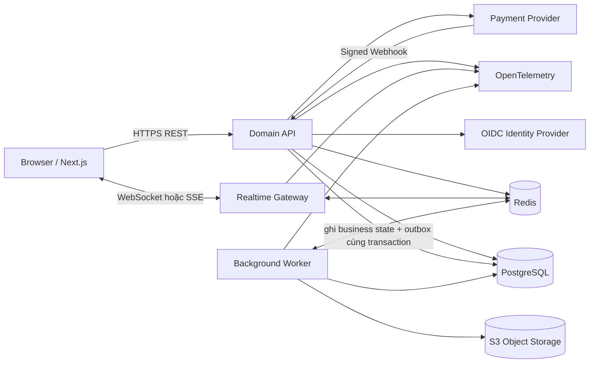
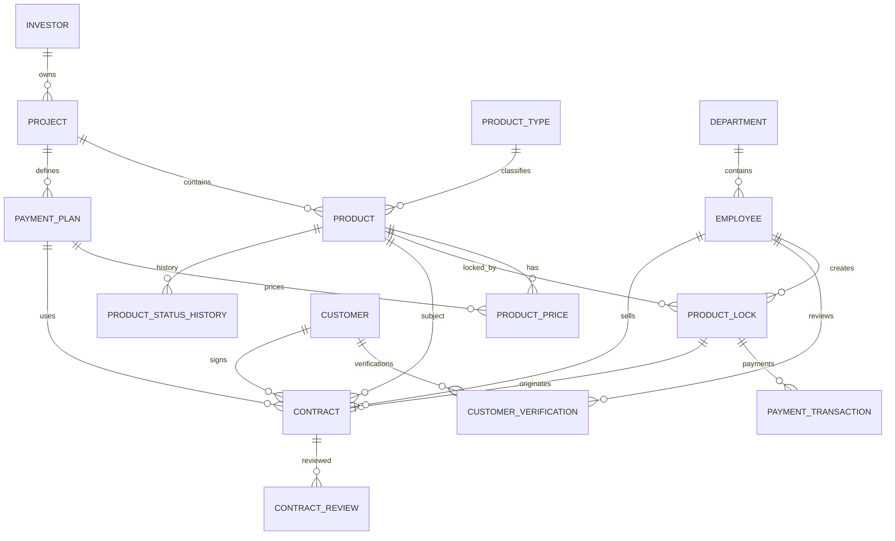
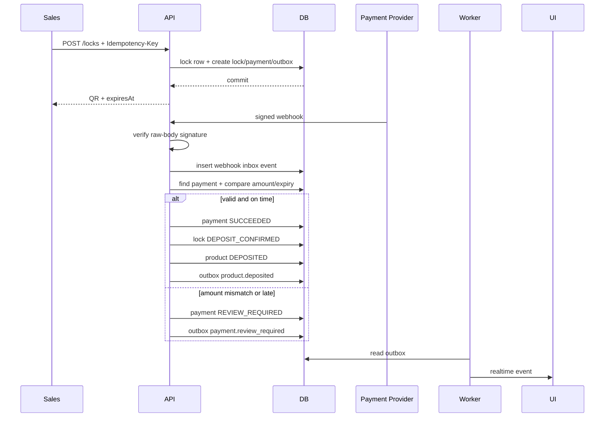
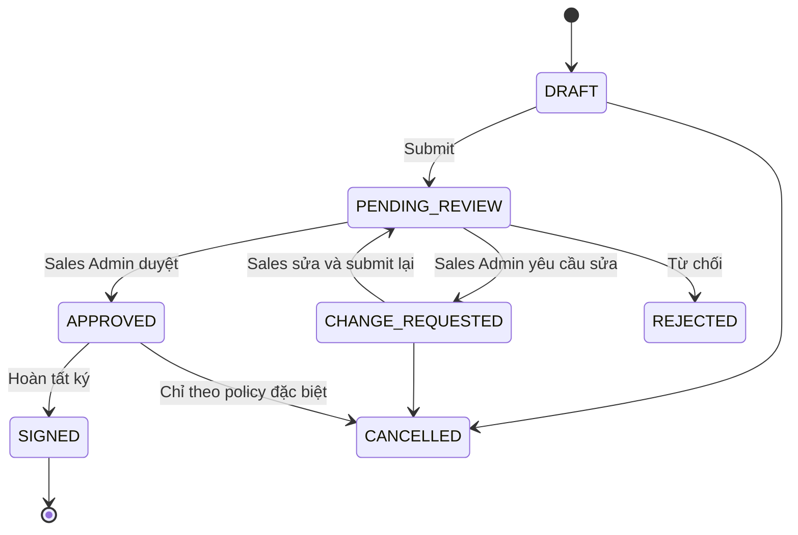
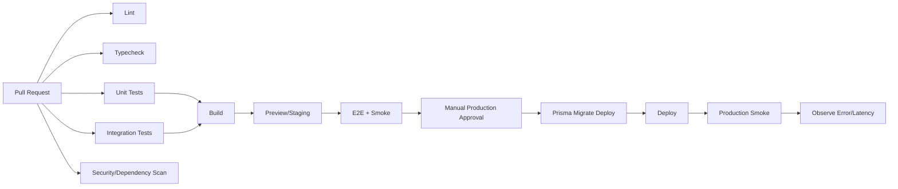
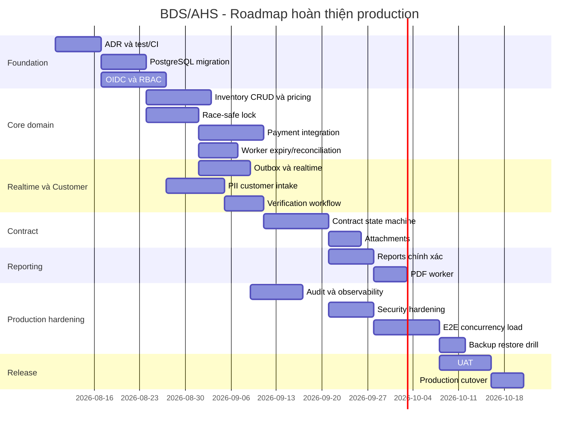

# Kế hoạch kỹ thuật chi tiết để sửa đổi và hoàn thiện hệ thống BDS/AHS

**Bản Markdown đầy đủ đã được tạo:** [Tải `BDS_KeHoach_HoanThien_Production.md`](sandbox:/mnt/data/BDS_KeHoach_HoanThien_Production.md)

> **Phạm vi nghiên cứu:** đặc tả nghiệp vụ trong tài liệu người dùng cung cấp, bao gồm yêu cầu chức năng/phi chức năng, BFD, DFD, class diagram, activity diagram và các mockup từ trang 1–21; đồng thời audit trực tiếp repository hiện tại `ptdbrain/BDS`. **Giới hạn nguồn:** lớp comment/suggestion riêng trên Google Docs tại URL được cung cấp không truy xuất được trong phiên nghiên cứu. Bản tài liệu đính kèm có đầy đủ nội dung và sơ đồ nghiệp vụ nhưng không cung cấp lớp comment Google Docs; vì vậy tôi **không tạo giả comment ID**. Bảng đối chiếu dùng mã `REQ-*` để ánh xạ từng yêu cầu và luồng có thể xác minh từ tài liệu vào code. fileciteturn0file0

## Tóm tắt điều hành và kết luận kiểm toán

Tài liệu mô tả một hệ thống quản lý nguồn hàng và giao dịch bất động sản nội bộ với ba vai trò nghiệp vụ cốt lõi: **nhân viên quản lý sản phẩm**, **nhân viên kinh doanh** và **Sales Admin**. Chuỗi nghiệp vụ xuyên suốt tài liệu là:

```text
Chủ đầu tư
   ↓
Dự án
   ↓
Quỹ hàng / Sản phẩm / Giá / Phương án thanh toán
   ↓
Sales xem bảng hàng
   ↓
Lock căn tối đa 30 phút
   ↓
Sinh QR / tiếp nhận thanh toán cọc
   ↓
Xác nhận cọc
   ↓
Khai báo khách hàng
   ↓
Sales Admin xác minh
   ↓
Lập và duyệt hợp đồng
   ↓
Ký hợp đồng → căn ĐÃ BÁN
   ↓
Báo cáo / thống kê / audit
```

Luồng này được củng cố đồng thời bởi BFD trang 3–4, DFD mức 0 và mức 1 trang 6–7, biểu đồ lớp trang 8–9, activity diagram ba vai trò trang 13–16 và các mockup trang 17–21. Đặc biệt, activity của Sales thể hiện rõ sequence **xem bảng hàng → lock → QR → chờ thanh toán trong 30 phút → xác nhận cọc → khai báo khách hàng**, còn Sales Admin đối chiếu thông tin và có nhánh yêu cầu chỉnh sửa trước khi duyệt. fileciteturn0file0

Repository hiện tại đã làm được khá nhiều ở mức **prototype/demo giàu chức năng**. Schema đã mở rộng đúng hướng hơn class diagram gốc khi có thêm `PaymentPlan`, `ProductPrice`, `PaymentTransaction`, `PaymentWebhookEvent`, `CustomerVerification`, `ContractReview`, `ProductStatusHistory`, `AuditLog`, `ReportExport`. Frontend cũng đã có inventory matrix, lock manager, customer workflow, contract workflow, reports và audit UI. fileciteturn9file0L2-L2 fileciteturn49file0L2-L2

Tuy nhiên, **không nên đưa phiên bản hiện tại vào production hoặc lưu dữ liệu khách hàng thật**. Các blocker lớn nhất là:

| Mức | Vấn đề | Hiện trạng code | Hậu quả |
|---|---|---|---|
| P0 | Database | Prisma đang dùng SQLite; Vercel copy DB vào `/tmp` | Dữ liệu không phù hợp cho nhiều instance và không phải kiến trúc lưu trữ production |
| P0 | Authentication | User/role giả lập trên client và `/auth/me?role=...` | Client có thể tự nhận vai Sales Admin/Manager |
| P0 | Authorization | Nhiều endpoint tin `actorId`, `reviewerId` do request body gửi lên | Có thể giả danh người khác thực hiện nghiệp vụ |
| P0 | Lock concurrency | Check product rồi create lock ở application layer | Có race condition khi nhiều Sales cùng lock một căn |
| P0 | Payment webhook | Signature gần như không được xác minh | Có thể giả webhook để biến căn thành `DEPOSITED` |
| P0 | PII | `cccdCiphertext` và `addressCiphertext` thực tế lưu plaintext | Rủi ro nghiêm trọng với CCCD/địa chỉ khách |
| P0 | Build/deploy | `npm build` tự `prisma db push` và seed | Deploy có side effect trên DB |
| P0 | Realtime | Polling 5 giây nhưng UI ghi “Socket Realtime Active” | Không phải realtime thật và gây hiểu nhầm |
| P0 | Report | Một số doanh thu được fallback bằng số căn × 4,5 tỷ | Báo cáo có thể hiển thị số liệu không có thật |
| P0 | Testing | `package.json` chưa có test script/gate | Không có lớp bảo vệ regression |

Các điểm trên có thể kiểm tra trực tiếp tại [Prisma schema](https://github.com/ptdbrain/BDS/blob/main/prisma/schema.prisma#L1-L279), [DB bootstrap](https://github.com/ptdbrain/BDS/blob/main/src/lib/db.ts#L1-L60), [page state và polling](https://github.com/ptdbrain/BDS/blob/main/src/app/page.tsx#L118-L170), [auth demo](https://github.com/ptdbrain/BDS/blob/main/src/app/api/v1/auth/me/route.ts#L1-L60), [lock service](https://github.com/ptdbrain/BDS/blob/main/src/lib/locks.ts#L1-L190), [VietQR webhook](https://github.com/ptdbrain/BDS/blob/main/src/app/api/v1/payments/webhooks/vietqr/route.ts#L1-L190) và [package scripts](https://github.com/ptdbrain/BDS/blob/main/package.json#L5-L13). fileciteturn18file0L2-L2 fileciteturn48file0L2-L2 fileciteturn21file0L2-L2 fileciteturn50file0L2-L2

**Kết luận kiến trúc:** không cần viết lại toàn bộ dự án. Nên giữ Next.js/React/Tailwind và phần lớn UI hiện có; thay lớp demo phía dưới bằng một backend/domain layer production-grade. Kiến trúc ưu tiên là **modular monolith hướng sự kiện**, với PostgreSQL làm source of truth, Redis hỗ trợ queue/realtime/cache, worker xử lý job nền, một transactional outbox phân phối domain event, OIDC cho authentication và WebSocket/SSE cho đồng bộ tức thời.

PostgreSQL phù hợp hơn SQLite cho nghiệp vụ này vì transaction, row-level locking và partial indexes có thể bảo vệ trực tiếp invariant “một căn không thể có hai lock đang hoạt động”; `numeric/decimal` cũng phù hợp hơn floating point để lưu tiền. citeturn6search0turn6search12turn15search0

Luật Bảo vệ dữ liệu cá nhân số 91/2025/QH15 và Nghị định 356/2025/NĐ-CP có hiệu lực từ ngày 01/01/2026, do đó việc xử lý CCCD và thông tin nhận dạng cần được xem là một phần thiết kế nền tảng, không phải tính năng phụ. Việc UI hiện ghi dòng “tuân thủ” không tự tạo ra sự tuân thủ về kỹ thuật hoặc pháp lý. citeturn12search13turn12search15

## Đối chiếu đặc tả với mã nguồn và danh mục thay đổi cụ thể

Bảng này là lớp truy vết chính giữa tài liệu và code. Danh sách chi tiết hơn, bao gồm endpoint, acceptance criteria và test case cho từng mục, nằm trong [bản Markdown hoàn chỉnh](sandbox:/mnt/data/BDS_KeHoach_HoanThien_Production.md).

| ID | Yêu cầu xác minh từ tài liệu | Hiện trạng | Code cần sửa | UI/UX cần sửa | Test bắt buộc |
|---|---|---|---|---|---|
| `REQ-PRODUCT-CRUD` | Product Admin thêm/sửa/xóa sản phẩm, dự án, quỹ hàng | Product chủ yếu GET/import; project GET | Bổ sung create/update/archive Product, Project, ProductType, PaymentPlan, ProductPrice | Drawer thêm/sửa; xác nhận archive; history | CRUD, duplicate, permission, version conflict |
| `REQ-PRODUCT-STATUS` | Cập nhật tự động trạng thái còn hàng/lock/cọc/bán | Status string và mutation phân tán | Central `ProductStateService`; DB enum/check | Badge thống nhất; tooltip | Toàn bộ state transition matrix |
| `REQ-PRICE-PLAN` | Giá theo từng phương án thanh toán | Schema có plan/price nhưng lock hard-code cọc | Decimal money; price resolver; snapshot giá | Sales chọn plan trước lock | Exact money, expired price, wrong plan |
| `REQ-INVENTORY-VIEW` | Sales xem bảng hàng theo dự án | UI khá đầy đủ | Server-side filters, pagination; fix min/max price | Giữ matrix + table | Filter, pagination, stale update |
| `REQ-LOCK` | Lock căn tối đa 30 phút | Transaction app-level, 30 phút hard-code | Row lock/conditional update + DB invariant | Modal xác nhận giá, cọc, expiry | 50–100 concurrent requests, chỉ một success |
| `REQ-PAYMENT-QR` | Sinh QR cho khách cọc | QR handmade/hard-code | Provider adapter + payment intent | QR + reference + countdown | Provider sandbox/contract test |
| `REQ-PAYMENT-CALLBACK` | Xác nhận cọc tự động | Có webhook nhưng signature giả | Raw-body signature, replay protection, inbox | Reconciliation UI | forged signature, duplicate webhook, late payment |
| `REQ-CUSTOMER` | Nhập họ tên, SĐT, CCCD, email, địa chỉ sau cọc | Có form nhưng chưa gắn chắc với lock/deposit | Encrypted PII + relation tới transaction | Mở form từ đúng lock | Cannot submit before deposit |
| `REQ-CUSTOMER-VERIFY` | Sales Admin xác minh/yêu cầu chỉnh sửa | Có workflow demo | Auth-derived reviewer, state guard, atomic transaction | Field-level discrepancy | double review, stale revision |
| `REQ-CONTRACT` | Hợp đồng nối customer-product-transaction | Có API nhưng precondition yếu | Contract aggregate + snapshot + uniqueness | Wizard đối chiếu 3 nguồn | deposit/customer/price preconditions |
| `REQ-CONTRACT-REVIEW` | Phê duyệt/từ chối/yêu cầu sửa | Approve/change có sẵn | Explicit reject, transition guard | Diff + bắt buộc reason | role/state/concurrency |
| `REQ-SIGN-SOLD` | Hoàn tất hợp đồng → đã bán | `mark-signed` chưa bắt APPROVED | `APPROVED → SIGNED → SOLD` atomic | Chỉ hiện nút đúng trạng thái | Cannot sign pending/rejected |
| `REQ-REPORT-REVENUE` | Doanh thu theo kỳ | Không date filter đầy đủ; fallback giả | Query theo period/status | Date/project filters | Reconciliation với fixture SQL |
| `REQ-REPORT-INVENTORY` | Lượng hàng theo dự án | Có KPI cơ bản | Aggregate từ state thật | Bảng giống mẫu tài liệu | Count consistency |
| `REQ-REPORT-SALES` | Doanh số Sales | Đang tính cả contract chưa chuẩn | Chính sách status được ghi nhận | Period/team filters | Status inclusion rules |
| `REQ-PDF` | Xuất PDF | jsPDF client, tiếng Việt không chuẩn | Worker HTML→PDF | Async export/download | Unicode, pagination, permission |
| `REQ-AUTH-RBAC` | Username/password và phân quyền | Role giả lập | OIDC + server authorization | Bỏ role switch production | endpoint permission matrix |
| `REQ-REALTIME` | Dữ liệu đồng bộ tự động | Polling 5 giây | Outbox→Redis→WebSocket/SSE | Connected/reconnecting/fallback | reconnect, replay, duplicate |
| `REQ-AUDIT` | Toàn vẹn và truy vết | Có AuditLog nhưng actor spoofable | Server-derived actor/correlation ID | Filter audit | no actor spoofing/no PII |
| `REQ-IMPORT` | Cập nhật quỹ hàng | Import sync đơn giản | staging→validate→job→commit | Import wizard | 10k rows, retry, duplicate |
| `REQ-BACKUP` | Backup/recovery | Chưa có cơ chế production | PITR + restore drill | Backup status | restore smoke test |

Ví dụ, yêu cầu **lock căn 30 phút** hiện đã có code ở [`src/lib/locks.ts`](https://github.com/ptdbrain/BDS/blob/main/src/lib/locks.ts#L48-L190), nhưng cần sửa tận gốc thay vì chỉ chỉnh UI. Code hiện tại gọi `sweepExpiredLocks()`, đọc product, kiểm `AVAILABLE`, tìm active lock rồi tạo lock; đó là một check-then-write flow và DB chưa áp đặt invariant đủ mạnh. Đồng thời thời gian `30 * 60 * 1000` và tiền cọc `100000000` đang bị hard-code, trong khi schema đã có `Project.lockDurationMinutes` và `ProductPrice.depositAmount`. fileciteturn16file0L2-L2

Phần khách hàng còn nguy hiểm hơn. [`customers/route.ts`](https://github.com/ptdbrain/BDS/blob/main/src/app/api/v1/customers/route.ts#L1-L150) tạo `cccdHash` bằng chuỗi `hash_${cccd}` chứ không phải cryptographic keyed hash; trường tên `cccdCiphertext` lại nhận trực tiếp CCCD plaintext. GET cũng dùng object spread trên record DB trước khi thêm field masked, khiến API contract cần được thiết kế lại theo DTO allow-list thay vì “đọc model rồi che thêm”. fileciteturn29file0L2-L2

Phần hợp đồng tại [`contracts/route.ts`](https://github.com/ptdbrain/BDS/blob/main/src/app/api/v1/contracts/route.ts#L1-L120) hiện có thể nhận `agreedPrice`, Sales ID từ body, dùng fallback 4,5 tỷ và không bắt buộc customer đã VERIFIED hoặc payment đã SUCCEEDED. [`mark-signed`](https://github.com/ptdbrain/BDS/blob/main/src/app/api/v1/contracts/%5Bid%5D/mark-signed/route.ts#L1-L90) lại có thể đưa căn thành `SOLD` mà chưa kiểm contract đã `APPROVED`. Đây là các lỗi business invariant, phải được fix ở domain service và DB transaction, không chỉ ẩn button trên frontend. fileciteturn31file0L2-L2 fileciteturn33file0L2-L2

Báo cáo tại [`reports/dashboard`](https://github.com/ptdbrain/BDS/blob/main/src/app/api/v1/reports/dashboard/route.ts#L1-L130) hiện có đoạn fallback doanh thu của project thành `projDepositCount * 4500000000` khi không có doanh thu hợp đồng. Logic này phải bị xóa hoàn toàn trước khi hệ thống được dùng cho reporting thực tế. fileciteturn35file0L2-L2

## Kiến trúc đích, lựa chọn công nghệ và mô hình dữ liệu

### Stack ưu tiên

Không có ràng buộc công nghệ cụ thể trong tài liệu nghiệp vụ ngoài yêu cầu ứng dụng web, realtime, bảo mật, backup và tích hợp. Vì vậy nên giữ tối đa tài sản code hiện hữu nhưng nâng backend/hạ tầng.

| Thành phần | Phương án ưu tiên | Phương án thứ hai | Đánh giá |
|---|---|---|---|
| Frontend | **Next.js + React + TypeScript** | Vite React SPA | Next.js đã có sẵn; giữ lại ít rủi ro nhất |
| UI | **Tailwind hiện tại + component primitives** | Ant Design | Tailwind giảm rewrite; AntD nhanh cho form/table enterprise |
| Backend | **NestJS + Fastify** | Next.js Route Handlers modularized | NestJS tốt hơn khi realtime/job/auth lớn; Route Handlers ít migration hơn |
| Database | **PostgreSQL** | MySQL | PostgreSQL ưu tiên vì lock/index/transaction và rich constraint |
| ORM | **Prisma** | Drizzle/Kysely | Prisma đã có schema và code hiện tại |
| Cache/queue | **Redis + BullMQ** | Managed queue cloud | Redis/BullMQ hợp TypeScript và delayed jobs |
| Realtime | **Socket.IO** | SSE | Socket.IO phù hợp bidirectional; SSE đơn giản hơn nếu chỉ server→client |
| Auth | **Keycloak OIDC** | Microsoft Entra ID | Keycloak tự chủ; Entra tốt nếu công ty dùng Microsoft 365 |
| Object storage | **S3-compatible** | Cloud provider blob native | Phù hợp hợp đồng, PDF, import file |
| PDF | **Playwright/Chromium worker** | React PDF | HTML→PDF tái dùng CSS và Unicode tốt |
| CI/CD | **GitHub Actions** | GitLab CI/Azure DevOps | Repo hiện ở GitHub |
| Container | **Docker multi-stage** | Native serverless | Container tốt hơn cho worker/realtime |
| Hosting | **Managed container + managed PG/Redis** | Vercel web + separate API/worker | Ưu tiên predictable long-lived workloads |
| Observability | **OpenTelemetry + Prometheus/Grafana/Loki** | Managed APM | OpenTelemetry vendor-neutral. citeturn9search6turn9search3 |

Vercel đã công bố WebSocket support ở mức Public Beta trong năm 2026, nhưng với workflow lock/payment quan trọng, tôi vẫn ưu tiên API/realtime gateway chạy trong môi trường container ổn định, trong khi Next.js frontend có thể tiếp tục chạy trên Vercel. Vercel cũng lưu ý kết nối stateful cần thiết kế external durable state thay vì dựa vào function instance. citeturn17search3turn17search0

Kiến trúc đề xuất:



Kiến trúc này giữ nghiệp vụ dưới dạng modular monolith:

```text
modules/
  identity/
  organization/
  projects/
  inventory/
  pricing/
  locks/
  payments/
  customers/
  verifications/
  contracts/
  reports/
  files/
  audit/
  notifications/
```

Redis không phải source of truth cho trạng thái căn. Trạng thái thật luôn ở PostgreSQL. Redis chỉ dùng cho BullMQ, pub/sub, cache, rate limit và Socket.IO adapter. Socket.IO bảo đảm ordering nhưng delivery mặc định là at-most-once, vì vậy các sự kiện business quan trọng phải được persisted và hỗ trợ replay bằng `eventId`/offset thay vì giả định socket tự bảo đảm delivery. citeturn10view0turn10view1

### Schema production đề xuất

Class diagram gốc cần được tôn trọng về quan hệ miền, nhưng schema kỹ thuật phải sửa các điểm không nhất quán. Ví dụ tài liệu mô tả `MaCan` kiểu `int` trong bảng Sản phẩm nhưng lại `nvarchar` ở Lock/Hợp đồng; tên dự án/chủ đầu tư có chỗ chỉ `nvarchar(10)`; khách hàng cần địa chỉ nhưng bảng gốc thiếu địa chỉ; cổng thanh toán xuất hiện trong DFD nhưng class diagram không có Payment. fileciteturn0file0

Mô hình đích:



Các thay đổi schema quan trọng:

**Tiền:** toàn bộ `Float` cho `amount`, `depositAmount`, `agreedPrice` phải chuyển sang `Decimal`/PostgreSQL `numeric(19,2)` hoặc nếu chắc chắn chỉ VND không có phần lẻ thì `bigint` theo đơn vị đồng. Prisma có hỗ trợ mapping `Decimal`; không nên dùng IEEE floating point cho giá trị tài chính. citeturn15search0turn15search2

**PII:** thay:

```prisma
cccdCiphertext    String
cccdHash          String
addressCiphertext String
```

bằng thiết kế rõ ý nghĩa hơn:

```prisma
model Customer {
  id                    String   @id @default(uuid())
  fullName              String
  phoneNormalized       String
  emailNormalized       String?
  identityCiphertext    Bytes
  identityNonce         Bytes
  identityKeyVersion    Int
  identityLookupHmac    Bytes    @unique
  addressCiphertext     Bytes?
  addressNonce          Bytes?
  verificationStatus    CustomerVerificationStatus
  createdAt             DateTime @default(now())
  updatedAt             DateTime @updatedAt
}
```

Không dùng SHA/plain hash CCCD đơn thuần cho lookup vì không gian giá trị CCCD có cấu trúc và có thể brute-force. Nên dùng HMAC với key quản lý riêng cho equality lookup; encryption data key dùng AES-GCM hoặc cơ chế envelope encryption tương đương. OWASP khuyến nghị quản lý key tách khỏi ciphertext và hạn chế đưa dữ liệu nhạy cảm vào logs. citeturn13search5turn13search0

**Lock:** cần invariant ở DB:

```sql
CREATE UNIQUE INDEX ux_one_live_lock_per_product
ON product_locks(product_id)
WHERE status IN ('ACTIVE', 'PAYMENT_PENDING');
```

và transaction ngắn:

```sql
BEGIN;

SELECT id, status, version
FROM products
WHERE id = $1
FOR UPDATE;

-- kiểm status = AVAILABLE
-- resolve project.lock_duration_minutes
-- resolve payment_plan / deposit_amount

INSERT INTO product_locks (...);

UPDATE products
SET status = 'LOCKED',
    version = version + 1
WHERE id = $1;

INSERT INTO product_status_history (...);
INSERT INTO outbox_events (...);

COMMIT;
```

Row lock chỉ tồn tại trong transaction ngắn vài mili giây; **không giữ DB transaction mở 30 phút**. Hạn 30 phút là dữ liệu `expires_at`. PostgreSQL row-level locking và partial indexes cung cấp đúng primitive cần thiết cho mô hình này. citeturn6search0turn6search12

**Transactional outbox** cần được bổ sung:

```sql
CREATE TABLE outbox_events (
    id UUID PRIMARY KEY,
    aggregate_type VARCHAR(64) NOT NULL,
    aggregate_id UUID NOT NULL,
    event_type VARCHAR(128) NOT NULL,
    payload JSONB NOT NULL,
    occurred_at TIMESTAMPTZ NOT NULL DEFAULT now(),
    published_at TIMESTAMPTZ,
    retry_count INTEGER NOT NULL DEFAULT 0
);

CREATE INDEX ix_outbox_unpublished
ON outbox_events(occurred_at)
WHERE published_at IS NULL;
```

Mọi thay đổi `Product → LOCKED`, `LOCKED → DEPOSITED`, `Contract → APPROVED`, `Product → SOLD` phải ghi state và event vào cùng transaction, tránh tình trạng DB commit thành công nhưng socket/job event bị mất.

## Đặc tả chức năng, API, realtime và pipeline theo từng miền

### Quản lý dự án, quỹ hàng và giá

Product Admin cần CRUD:

```http
POST   /api/v1/projects
GET    /api/v1/projects
GET    /api/v1/projects/:id
PATCH  /api/v1/projects/:id

POST   /api/v1/product-types
PATCH  /api/v1/product-types/:id

POST   /api/v1/products
GET    /api/v1/products
GET    /api/v1/products/:id
PATCH  /api/v1/products/:id
POST   /api/v1/products/:id/archive

POST   /api/v1/payment-plans
PATCH  /api/v1/payment-plans/:id

POST   /api/v1/products/:productId/prices
PATCH  /api/v1/product-prices/:priceId
```

Ví dụ tạo sản phẩm:

```json
{
  "projectId": "b5ba...",
  "productTypeId": "c8fd...",
  "productCode": "A101",
  "building": "A",
  "floor": 10,
  "area": "70.00",
  "direction": "Đông Nam",
  "handoverPlan": "HOAN_THIEN",
  "prices": [
    {
      "paymentPlanId": "pp-standard",
      "amount": "2500000000.00",
      "depositAmount": "200000000.00",
      "validFrom": "2026-08-10T00:00:00+07:00"
    }
  ]
}
```

Response:

```json
{
  "data": {
    "id": "product-uuid",
    "productCode": "A101",
    "status": "AVAILABLE",
    "version": 1
  },
  "meta": {
    "requestId": "01J..."
  }
}
```

`PATCH` phải dùng optimistic concurrency:

```http
If-Match: "7"
```

hoặc body:

```json
{
  "version": 7,
  "area": "70.50"
}
```

Nếu một admin khác đã sửa version 8:

```http
409 Conflict
```

```json
{
  "type": "https://ahs.vn/problems/version-conflict",
  "title": "Dữ liệu đã thay đổi",
  "status": 409,
  "code": "VERSION_CONFLICT",
  "detail": "Sản phẩm đã được người dùng khác cập nhật.",
  "requestId": "..."
}
```

Kiểu Problem Details nên chuẩn hóa theo RFC 9457 thay vì mỗi route tự trả `{ error: ... }` theo hình thức khác nhau. citeturn16view0

### Lock căn và realtime

API:

```http
POST /api/v1/locks
Idempotency-Key: 82dc...
```

```json
{
  "productId": "product-uuid",
  "paymentPlanId": "payment-plan-uuid"
}
```

**Không có** `salesEmployeeId` hay `salesEmployeeName` trong request. Backend lấy actor từ session/token.

Response:

```json
{
  "data": {
    "lockId": "lock-uuid",
    "productId": "product-uuid",
    "status": "ACTIVE",
    "startedAt": "2026-08-09T15:20:00+07:00",
    "expiresAt": "2026-08-09T15:50:00+07:00",
    "payment": {
      "id": "payment-uuid",
      "providerReference": "AHS-A101-01J...",
      "amount": "200000000.00",
      "currency": "VND",
      "status": "PENDING",
      "qrPayload": "..."
    }
  }
}
```

Race condition phải được giải quyết bằng database, không bằng disabled button.

Pseudo flow:

```ts
async function lockProduct(ctx, input) {
  return db.transaction(async tx => {
    const product = await tx.queryForUpdate(input.productId);

    assert(product.status === 'AVAILABLE');

    const price = await resolveActivePrice(
      tx,
      product.id,
      input.paymentPlanId,
      ctx.now
    );

    const expiresAt =
      addMinutes(ctx.now, product.project.lockDurationMinutes);

    const lock = await tx.productLock.create({
      productId: product.id,
      employeeId: ctx.employeeId,
      paymentPlanId: price.paymentPlanId,
      lockedPrice: price.amount,
      depositAmount: price.depositAmount,
      expiresAt
    });

    await tx.product.setStatus(product.id, 'LOCKED');
    await tx.statusHistory.append(...);
    await tx.outbox.append('product.locked', ...);

    return lock;
  });
}
```

Khi event `product.locked` được worker publisher phát:

```json
{
  "eventId": "01J...",
  "type": "product.locked",
  "projectId": "...",
  "productId": "...",
  "productCode": "A101",
  "status": "LOCKED",
  "expiresAt": "...",
  "version": 8
}
```

Frontend đang xem project đó nhận event và cập nhật TanStack Query cache ngay. Nếu mất connection:

```text
socket disconnected
      ↓
UI báo "Đang kết nối lại"
      ↓
reconnect
      ↓
client gửi lastEventId
      ↓
server replay event còn thiếu
      ↓
invalidate/re-fetch snapshot
```

Polling 5 giây hiện tại trong [`src/app/page.tsx`](https://github.com/ptdbrain/BDS/blob/main/src/app/page.tsx#L136-L146) có thể giữ lại làm **fallback**, nhưng phải bỏ nhãn “Socket Realtime Active” nếu chưa có connection thực. fileciteturn48file0L2-L2

### Thanh toán và VietQR

DFD có “Cổng thanh toán”, vì vậy payment là domain bắt buộc dù class diagram gốc chưa vẽ lớp tương ứng. fileciteturn0file0

Kiến trúc payment phải theo adapter:

```ts
interface PaymentProvider {
  createPaymentIntent(input: CreatePaymentIntentInput):
    Promise<CreatePaymentIntentResult>;

  verifyWebhook(rawBody: Buffer, headers: Headers):
    Promise<VerifiedPaymentEvent>;
}
```

VietQR có tài liệu cho sandbox, QR generation, transaction synchronization/test callback và security credentials, nên integration production phải đi theo thông số provider thực thay vì tự nối một chuỗi QR payload như hiện tại. citeturn14search0turn14search3turn14search13

Webhook flow:



Webhook hiện tại ở [`payments/webhooks/vietqr/route.ts`](https://github.com/ptdbrain/BDS/blob/main/src/app/api/v1/payments/webhooks/vietqr/route.ts#L1-L190) phải thay hoàn toàn phần:

```ts
signatureValid: signature ? signature !== 'INVALID' : true
```

vì hiện tại **không có signature cũng được coi là valid**. Ngoài signature, cần `providerEventId` uniqueness, timestamp/replay window, raw request body, constant-time verification nếu provider yêu cầu HMAC, payload size limit, allowlist/rate limit phù hợp và audit sự kiện ngoại lệ. fileciteturn21file0L2-L2

### Customer và Sales Admin verification

Customer form chỉ được mở từ lock có:

```text
ProductLock.status = DEPOSIT_CONFIRMED
AND PaymentTransaction.status = SUCCEEDED
```

trừ khi nghiệp vụ chọn phương án khác một cách rõ ràng.

API:

```http
POST /api/v1/locks/:lockId/customer
```

```json
{
  "fullName": "Nguyễn Văn A",
  "phone": "0987654321",
  "email": "a@example.com",
  "identityNumber": "001...",
  "address": "...",
  "privacyNoticeVersion": "2026-01"
}
```

Backend thực hiện:

```text
validate
→ normalize phone/email/identity
→ HMAC identity for duplicate lookup
→ encrypt identity/address
→ create/reuse customer
→ create CustomerVerification PENDING
→ audit metadata đã được sanitize
→ outbox customer.verification_requested
```

Sales Admin:

```http
POST /api/v1/customer-verifications/:id/approve
POST /api/v1/customer-verifications/:id/request-changes
POST /api/v1/customer-verifications/:id/reject
```

Không nhận `reviewerId` từ client. Reviewer phải luôn là identity được backend xác thực.

UI cần cho Sales Admin nhìn:

```text
Khách hàng
├── Họ tên
├── Phone masked
├── CCCD masked, reveal theo permission
├── Email
├── Địa chỉ masked
├── Căn / dự án / Sales
├── Mã thanh toán
├── Thời gian cọc
└── Danh sách vấn đề
    ├── CCCD sai
    ├── Họ tên không khớp
    └── Địa chỉ cần bổ sung
```

Khi reveal CCCD, backend phải kiểm permission riêng, audit hành động và chỉ trả field được phép; không trả toàn object customer rồi kỳ vọng frontend tự che.

### Contract

Điều kiện trước khi tạo contract:

```text
Customer.verificationStatus == VERIFIED
Payment.status == SUCCEEDED
Lock.status == DEPOSIT_CONFIRMED
Lock.productId == input.productId
Lock.salesEmployeeId == authenticated Sales hoặc user có override permission
PaymentPlan.projectId == Product.projectId
Product.status == DEPOSITED
Không tồn tại contract active khác xung đột
```

Flow:



Chuyển `APPROVED → SIGNED` phải chạy transaction:

```ts
await tx.contract.update({
  where: { id, status: 'APPROVED' },
  data: { status: 'SIGNED', signedAt: now }
});

await tx.product.update({
  where: { id: contract.productId, status: 'DEPOSITED' },
  data: { status: 'SOLD' }
});

await tx.productStatusHistory.create(...);
await tx.outboxEvent.create({
  type: 'contract.signed',
  ...
});
```

Nếu update affected rows = 0 thì trả `409 STATE_TRANSITION_NOT_ALLOWED`, không tự “cố gắng” ghi trạng thái.

### Reports và PDF

Ba báo cáo trong tài liệu phải trở thành ba query contract riêng:

```http
GET /api/v1/reports/revenue?from=...&to=...&projectId=...
GET /api/v1/reports/inventory?asOf=...&projectId=...
GET /api/v1/reports/sales-performance?from=...&to=...&employeeId=...
```

Xuất file:

```http
POST /api/v1/report-exports
```

```json
{
  "reportType": "REVENUE",
  "filters": {
    "from": "2026-01-01",
    "to": "2026-12-31"
  },
  "format": "PDF"
}
```

Response:

```json
{
  "data": {
    "exportId": "...",
    "status": "QUEUED"
  }
}
```

Pipeline:

```text
API
→ create ReportExport QUEUED
→ BullMQ report-export
→ worker query snapshot data
→ render HTML template tiếng Việt
→ Chromium PDF
→ upload S3
→ checksum
→ ReportExport COMPLETED
→ realtime report.completed
→ UI hiển thị Download
```

BullMQ hỗ trợ delayed jobs, retry/backoff và deduplication; job vẫn phải idempotent vì retry là hành vi bình thường của hệ thống queue. citeturn8search0turn8search2turn8search5

## Bảo mật, xử lý lỗi, logging, monitoring và triển khai production

### Authentication và authorization

Hai lựa chọn ưu tiên:

**Phương án ưu tiên – Keycloak/OIDC**

Ưu điểm: tự chủ, hỗ trợ OIDC, realm/client/role mappings, phù hợp ứng dụng doanh nghiệp. Keycloak có cơ chế đưa role vào token thông qua role scope mappings. citeturn8search3

**Phương án hai – Microsoft Entra ID**

Ưu điểm: nếu doanh nghiệp đã dùng Microsoft 365/Entra, vòng đời user, MFA và offboarding dễ tích hợp hơn. Nhược điểm là phụ thuộc tenant và cấu hình doanh nghiệp.

Role tối thiểu:

| Permission | Sales | Product Admin | Sales Admin | Manager | Auditor |
|---|---:|---:|---:|---:|---:|
| Xem bảng hàng | ✓ | ✓ | ✓ | ✓ | ✓ |
| Lock căn | ✓ |  |  | override |  |
| Hủy lock của mình | ✓ |  |  | override |  |
| CRUD sản phẩm |  | ✓ |  | ✓ |  |
| Sửa giá |  | ✓ |  | policy |  |
| Tạo customer | ✓ |  |  | ✓ |  |
| Reveal PII | limited | limited | ✓ | policy | audited |
| Duyệt customer |  |  | ✓ | ✓ |  |
| Tạo contract | ✓ |  |  | ✓ |  |
| Duyệt contract |  |  | ✓ | ✓ |  |
| Mark signed | policy |  | ✓ | ✓ |  |
| Báo cáo | own/team | inventory | operations | ✓ | read |
| Audit log | own subset | subset | subset | ✓ | ✓ |

**Frontend permission chỉ phục vụ UX. Backend phải kiểm permission cho mọi command/query.** Điều này cũng ngăn IDOR/BOLA: việc biết một `contractId`, `customerId` hoặc `lockId` không đồng nghĩa người dùng được phép thao tác resource đó. citeturn13search1

### Error model

Mọi API dùng một format:

```json
{
  "type": "https://ahs.vn/problems/product-already-locked",
  "title": "Sản phẩm đã được giữ",
  "status": 409,
  "code": "PRODUCT_ALREADY_LOCKED",
  "detail": "Căn A101 vừa được nhân viên khác khóa.",
  "instance": "/api/v1/locks",
  "requestId": "01J...",
  "errors": []
}
```

Phân loại:

```text
400 VALIDATION_FAILED
401 UNAUTHENTICATED
403 FORBIDDEN
404 RESOURCE_NOT_FOUND
409 PRODUCT_ALREADY_LOCKED
409 VERSION_CONFLICT
409 STATE_TRANSITION_NOT_ALLOWED
422 BUSINESS_RULE_VIOLATION
429 RATE_LIMITED
502 PROVIDER_ERROR
503 TEMPORARILY_UNAVAILABLE
```

Các lỗi nội bộ không trả Prisma error, SQL, stack trace hay secret về browser.

### Logging và audit

Structured application log:

```json
{
  "timestamp": "...",
  "level": "info",
  "service": "bds-api",
  "requestId": "...",
  "traceId": "...",
  "actorId": "...",
  "route": "POST /api/v1/locks",
  "statusCode": 201,
  "latencyMs": 42
}
```

Không log:

```text
password
access token
refresh token
raw CCCD
raw address
payment provider secrets
encryption keys
full webhook secret-bearing headers
```

OWASP lưu ý log không nên chứa authentication tokens, sensitive personal data hoặc secrets trực tiếp. citeturn13search0

Audit business riêng:

```json
{
  "actorId": "...",
  "action": "APPROVE_CONTRACT",
  "entityType": "CONTRACT",
  "entityId": "...",
  "before": {
    "status": "PENDING_REVIEW"
  },
  "after": {
    "status": "APPROVED"
  },
  "requestId": "...",
  "occurredAt": "..."
}
```

### Monitoring và SLO

Theo dõi tối thiểu:

```text
HTTP
- request rate
- P50/P95/P99 latency
- 4xx/5xx rate

Business
- lock attempts
- lock conflicts
- active locks
- expired locks
- successful deposits
- late/mismatch payments
- pending verification age
- pending contract review age

DB
- connection pool
- slow queries
- lock waits/deadlocks
- CPU/storage

Queue
- waiting/active/delayed/failed
- oldest job age

Realtime
- connected clients
- reconnects
- event publish latency
- replay count

Security
- failed login
- forbidden attempts
- PII reveals
- invalid payment signatures
- replay attempts
```

OpenTelemetry phù hợp để chuẩn hóa traces, metrics và logs mà không khóa ứng dụng vào một APM cụ thể. citeturn9search6turn9search3

### Deployment

Đề xuất repository:

```text
/apps
  /web
  /api
  /worker

/packages
  /domain
  /contracts
  /db
  /observability
  /eslint-config
```

hoặc trong giai đoạn đầu vẫn monorepo Next.js nhưng tách service layer rõ ràng.

Không để:

```json
"build": "prisma generate && prisma db push && node prisma/seed.mjs && next build"
```

như hiện tại. fileciteturn50file0L2-L2

Thay bằng:

```json
{
  "build": "prisma generate && next build",
  "db:migrate:deploy": "prisma migrate deploy",
  "db:seed:demo": "node prisma/seed.mjs",
  "test": "vitest run",
  "test:integration": "...",
  "test:e2e": "playwright test",
  "lint": "...",
  "typecheck": "tsc --noEmit"
}
```

Pipeline:



Docker nên dùng multi-stage build để giảm image runtime và không mang toàn bộ build toolchain vào production image. citeturn10view2

Database production cần managed PostgreSQL với automated backup/PITR. Prisma Postgres hiện cũng cung cấp connection pooling và backup/PITR trong managed offering; AWS RDS, Azure Database for PostgreSQL, Cloud SQL, Neon/Supabase hoặc nhà cung cấp tương đương đều là những lựa chọn hợp lý tùy hạ tầng tổ chức. citeturn15search6turn15search8

Rollback phải có hai lớp:

```text
Application:
new image → canary → smoke → promote
failure → route traffic back to previous image

Database:
migration mặc định backward-compatible
expand → deploy app → migrate data → contract schema later
```

Không thiết kế rollback bằng cách “DROP COLUMN ngược lại” sau khi production đã ghi data mới.

## Chiến lược kiểm thử và bộ test bắt buộc

Repository hiện chưa có testing pipeline tương xứng với mức rủi ro của workflow bán hàng. fileciteturn50file0L2-L2

Test pyramid đề xuất:

```text
               E2E
             /     \
       Integration / API
      /                   \
   Unit / Domain / Validation
```

### Unit test

Các state machine phải test như bảng chân trị.

Product:

```text
AVAILABLE → LOCKED          allowed
LOCKED → AVAILABLE          allowed on expire/cancel
LOCKED → DEPOSITED          allowed on valid payment
DEPOSITED → SOLD            allowed on signed contract
SOLD → AVAILABLE            forbidden
AVAILABLE → SOLD            forbidden
LOCKED → SOLD               forbidden
```

Contract:

```text
DRAFT → PENDING_REVIEW               allowed
PENDING_REVIEW → APPROVED            allowed
PENDING_REVIEW → CHANGE_REQUESTED     allowed
CHANGE_REQUESTED → PENDING_REVIEW     allowed
PENDING_REVIEW → REJECTED             allowed
APPROVED → SIGNED                     allowed
PENDING_REVIEW → SIGNED               forbidden
REJECTED → SIGNED                     forbidden
```

Price resolver:

```ts
it('chọn đúng giá còn hiệu lực theo plan và timestamp', async () => {
  const price = resolvePrice({
    prices: [
      { from: '2026-01-01', to: '2026-06-30', amount: '2.4B' },
      { from: '2026-07-01', to: null, amount: '2.5B' }
    ],
    at: '2026-08-09'
  });

  expect(price.amount).toEqual('2500000000.00');
});
```

### Integration test quan trọng nhất: lock concurrency

```ts
it('100 request cùng lock một căn chỉ có 1 request thành công', async () => {
  const responses = await Promise.all(
    Array.from({ length: 100 }, (_, index) =>
      api.lockProduct({
        productId,
        user: salesUsers[index],
        idempotencyKey: crypto.randomUUID()
      })
    )
  );

  expect(responses.filter(x => x.status === 201)).toHaveLength(1);
  expect(responses.filter(x => x.status === 409)).toHaveLength(99);

  expect(
    await db.productLock.count({
      where: {
        productId,
        status: { in: ['ACTIVE', 'PAYMENT_PENDING'] }
      }
    })
  ).toBe(1);
});
```

Đây phải là test chạy với **PostgreSQL thật trong container CI**, không dùng SQLite/in-memory DB, vì mục tiêu chính là kiểm tra hành vi transaction/locking của database.

### Payment test

Các case bắt buộc:

| Case | Kỳ vọng |
|---|---|
| Webhook signature đúng, amount đúng, trước expiry | Payment `SUCCEEDED`, product `DEPOSITED` |
| Signature sai | 401/403; state không đổi |
| Không signature | reject |
| Event ID gửi hai lần | side effect chỉ một lần |
| Amount thiếu | `REVIEW_REQUIRED` |
| Amount thừa | policy/review |
| Paid sau expiry | `REVIEW_REQUIRED` |
| Payment đúng nhưng product đã thay state bất hợp lệ | không overwrite state |
| Provider timeout | retry/idempotent |
| Webhook reorder | state machine vẫn an toàn |

### Customer/PII test

Phải chứng minh:

```text
DB không lưu CCCD plaintext
log không chứa CCCD
GET list không có raw CCCD
Sales không thể reveal customer ngoài scope
Sales Admin reveal được theo permission
mỗi reveal tạo audit entry
duplicate detection hoạt động trên normalized identity
ciphertext decrypt đúng với key hiện tại
rotation key version vẫn đọc được dữ liệu cũ
```

OWASP cảnh báo cả IDOR/BOLA và excessive data exposure, nên E2E security test phải kiểm không chỉ UI mà cả việc gọi API bằng ID resource tùy ý. citeturn13search1turn13search6

### Contract test

Các case tối thiểu:

```text
customer chưa VERIFIED → không tạo contract
payment PENDING → không tạo
payment REVIEW_REQUIRED → không tự cho qua
product không trùng lock → không tạo
payment plan khác project → không tạo
contract PENDING → không sign
contract REJECTED → không sign
APPROVED → SIGNED → product SOLD atomic
DB fail giữa contract/product update → rollback cả hai
double-click sign → chỉ một transition
```

### E2E theo activity diagram

Sales:

```text
login Sales
→ project
→ xem AVAILABLE unit
→ lock
→ unit biến LOCKED ở browser Sales thứ hai
→ mở QR
→ simulate/provider sandbox payment
→ unit DEPOSITED
→ nhập customer
→ Sales Admin thấy pending
→ Sales Admin approve
→ Sales tạo contract
→ Sales Admin approve
→ mark signed
→ unit SOLD
→ report tăng đúng
→ audit có toàn bộ chain
```

Product Admin:

```text
login Product Admin
→ tạo project/product
→ validation invalid
→ sửa
→ price plan
→ inventory cập nhật realtime
→ Sales thấy product mới
```

Sales Admin:

```text
nhận verification
→ reveal PII có audit
→ request changes
→ Sales sửa
→ submit lại
→ approve
→ review contract
→ approve/reject
```

### Performance target ban đầu

Nên baseline:

```text
Inventory read: P95 < 300 ms
Lock command: P95 < 500 ms khi tải bình thường
Realtime propagation: P95 < 1 s
Webhook processing: P95 < 500 ms trước khi ACK nếu xử lý sync nhỏ
Report dashboard: P95 < 1 s cho query phổ biến
10,000-row import: async, không block web request
```

Các con số này là **target kỹ thuật đề xuất**, không phải yêu cầu đã có trong tài liệu; sau load test phải điều chỉnh theo quy mô user/project thực tế.

## Lộ trình ưu tiên, ước lượng, rủi ro, rollback và các điểm mơ hồ

Ước lượng dưới đây giả định codebase hiện tại được giữ lại, đội khoảng ba developer có kinh nghiệm TypeScript cộng QA part-time. Đây là engineering estimate, có biên độ khoảng ±25–35%.

| Workstream | Công việc | Effort |
|---|---|---:|
| Foundation | ADR/architecture decisions | 24h |
| Foundation | Test framework + CI | 32h |
| Database | PostgreSQL migration | 40h |
| Database | Remove runtime auto-seed/demo DB | 16h |
| Identity | OIDC + session + RBAC | 56h |
| API platform | Validation/DTO/Problem Details | 24h |
| Inventory | CRUD Product/Project/Price/Plan | 56h |
| Inventory | Production import pipeline | 32h |
| Transaction | Race-safe lock | 56h |
| Payment | Provider adapter + secure webhook | 64h |
| Worker | Expiry/reconciliation jobs | 32h |
| Realtime | Outbox + Socket.IO/SSE + replay | 48h |
| Customer | PII encryption + intake | 56h |
| Verification | Sales Admin workflow | 32h |
| Contract | Contract state machine/workflow | 56h |
| Files | Attachment/object storage | 32h |
| Reports | Correct reporting queries | 40h |
| Reports | Server PDF export | 32h |
| Audit | Secure audit trail | 32h |
| Observability | OTel/metrics/logging/alerts | 40h |
| Security | Hardening/threat-model fixes | 32h |
| QA | E2E/concurrency/load suite | 56h |
| Reliability | Backup/restore drill | 24h |
| UAT | Business acceptance/fix cycle | 40h |
| Release | Production setup/cutover | 40h |
| **Tổng ước lượng** | | **~936 giờ / ~117 dev-days** |

Với ba developer và QA part-time, lịch thực tế khoảng **10–14 tuần**, tùy mức độ integration payment/identity và số vòng UAT.



### Milestone đề xuất

**Milestone Foundation:** PostgreSQL, migrations, CI, auth/RBAC và standardized error handling hoạt động. Không làm thêm feature production cho tới khi actor không còn đến từ body.

**Milestone Inventory & Lock:** Product/price management hoàn chỉnh; 100 concurrent lock attempts chỉ một request thành công.

**Milestone Payment & Realtime:** QR/payment provider thật, webhook đã xác minh, expiry worker, outbox và realtime.

**Milestone Customer & Contract:** PII encryption, Sales Admin review, contract preconditions, ký hợp đồng atomically chuyển căn SOLD.

**Milestone Reporting:** ba báo cáo đúng tài liệu, filter thời gian/project, PDF server side.

**Milestone Production readiness:** audit, observability, security, load test, backup restore, UAT, runbook và rollback.

### Rủi ro và rollback

| Rủi ro | Xác suất | Tác động | Biện pháp |
|---|---|---|---|
| Double-lock trong traffic thật | Cao nếu giữ code cũ | Rất cao | DB invariant + concurrency test |
| Webhook giả/replay | Cao nếu giữ code cũ | Rất cao | Provider signature + inbox idempotency |
| Lộ CCCD | Cao nếu import dữ liệu thật vào code cũ | Rất cao | Encryption trước data migration |
| Migration SQLite→PG sai kiểu/ID | Trung bình | Cao | Shadow migration + checksums |
| Realtime mất event | Trung bình | Cao | Outbox + replay + snapshot refetch |
| Redis outage | Trung bình | Trung bình | DB source of truth + polling fallback |
| Payment provider downtime | Trung bình | Cao | Retry, pending state, reconciliation |
| Báo cáo lệch kế toán | Trung bình | Rất cao | Định nghĩa revenue trước coding + reconciliation fixtures |
| Migration schema breaking | Trung bình | Cao | Expand/contract migration |
| UAT phát hiện workflow khác tài liệu | Cao | Trung bình | Feature flags + milestone UAT |

Rollback deployment:

```text
deploy version N+1
→ canary
→ smoke
→ metrics stable?
   ├─ yes → promote
   └─ no  → traffic → version N

DB schema:
expand schema
→ deploy compatible app
→ backfill
→ verify
→ switch reads/writes
→ contract old schema ở release sau
```

Feature flag cần có ít nhất:

```text
PAYMENT_PROVIDER_LIVE
REALTIME_V2
REPORTS_V2
PII_ENCRYPTION_REQUIRED
CONTRACT_WORKFLOW_V2
```

Không rollback payment bằng cách xóa record thành công. Financial/business events phải được sửa bằng compensating operation và audit.

### Các điểm mơ hồ trong tài liệu và hai phương án xử lý

| Điểm mơ hồ | Phương án A | Phương án B | Khuyến nghị |
|---|---|---|---|
| Comment riêng trên Google Doc chưa truy xuất được | Dùng REQ từ nội dung tài liệu hiện có | Sau này overlay comment Google Docs thành `GDOC-*` | Không đoán comment; giữ traceability ID |
| “Lock 30 phút” cố định hay theo dự án | Hard-code 30m | `Project.lockDurationMinutes` | **B** |
| Payment provider cụ thể | VietQR/bank integration trực tiếp | Payment abstraction nhiều provider | **B**, adapter đầu tiên là provider thực tế |
| “Doanh thu” nghĩa là gì | Giá trị hợp đồng ký | Tiền thực thu | Cần chốt; hỗ trợ cả hai metric |
| Khai khách chỉ sau thanh toán | Cứng như activity | Cho CRM lead trước cọc | MVP theo tài liệu: **A** |
| Một căn có bao nhiêu contract lịch sử | Một contract duy nhất | Nhiều bản nháp/hủy, chỉ một active/signed | **B** |
| Reject contract có cho resubmit | Reject terminal | Reject giống change request mạnh | Nên tách rõ `REJECTED` và `CHANGE_REQUESTED` |
| Cọc thành công nhưng contract bị reject | Giữ căn DEPOSITED chờ xử lý | Workflow hoàn/hủy riêng | Cần business decision, không tự release |
| Consent xử lý PII | Checkbox luôn bắt buộc | Legal basis khác tùy mục đích | Cần privacy/legal review |
| `MaCan` int hay string | Giữ mã int | UUID technical key + productCode string | **B** |
| Giá theo phương án | Một giá product | Versioned price per payment plan | **B** |
| Realtime | WebSocket | SSE | Socket.IO nếu cần bidirectional; SSE nếu chỉ push |
| Chủ đầu tư trong DFD có API không | Manual back-office | External integration | MVP **A**, adapter-ready |
| Manager role | Không thêm vì class diagram không có | Thêm role phục vụ report/override | **B**, nhưng là extension |
| Delete product | Hard delete | Archive/soft delete | **B** khi đã phát sinh giao dịch |

### Definition of Done cuối cùng

Hệ thống chỉ nên được coi là “hoàn chỉnh” khi đồng thời đạt các điều kiện:

```text
[ ] Production không còn SQLite hoặc runtime demo seed
[ ] Build không mutate/seed DB
[ ] Không endpoint nào tin actor/reviewer ID từ browser
[ ] Authentication và authorization chạy server-side
[ ] Database bảo đảm một căn chỉ có một live lock
[ ] Stress test 100 lock song song chỉ một success
[ ] Lock duration và deposit lấy từ configuration/price thật
[ ] Webhook thiếu/sai signature không thể thay đổi trạng thái
[ ] Webhook duplicate không tạo side effect lần hai
[ ] CCCD không tồn tại plaintext trong DB/log/API list
[ ] PII reveal bắt permission và tạo audit
[ ] Customer workflow gắn với payment/lock đúng nghiệp vụ
[ ] Không thể ký contract trước APPROVED
[ ] SIGNED và SOLD cập nhật atomically
[ ] Báo cáo không chứa fallback/fake business data
[ ] Số liệu báo cáo reconcile được với DB fixtures
[ ] PDF hỗ trợ đầy đủ tiếng Việt
[ ] Realtime có reconnect/replay hoặc snapshot fallback
[ ] Redis outage không làm mất source-of-truth
[ ] Import có validate/dry-run/error report
[ ] Unit + integration + E2E + security + concurrency tests chạy CI
[ ] PostgreSQL backup/PITR được cấu hình
[ ] Đã thực hành restore backup thành công
[ ] Alert cho payment failure, DB, queue và 5xx
[ ] Có runbook incident và rollback
[ ] UAT ba vai trò nghiệp vụ đã sign-off
```

Theo đánh giá tổng thể, repository hiện tại là **nền prototype tốt để tiếp tục phát triển**, không phải code cần bỏ đi. Giá trị lớn nhất đã có là UI workflow, vocabulary nghiệp vụ và schema mở rộng; phần cần đầu tư mạnh nhất là **database consistency, identity/RBAC, payment security, PII protection, domain state machine, event/realtime architecture, testing và production operations**. Nếu triển khai theo thứ tự P0 → P1 → P2 trong kế hoạch, hệ thống có thể tiến từ demo hiện tại thành một ứng dụng quản lý giao dịch bất động sản có tính nhất quán, truy vết và khả năng vận hành production mà vẫn bảo toàn phần lớn code frontend đã viết. fileciteturn0file0 fileciteturn49file0L2-L2

**Tài liệu đầy đủ với toàn bộ API contract, migration mẫu, pseudocode, mapping chi tiết, test matrix, risk register và roadmap:** [Tải `BDS_KeHoach_HoanThien_Production.md`](sandbox:/mnt/data/BDS_KeHoach_HoanThien_Production.md)